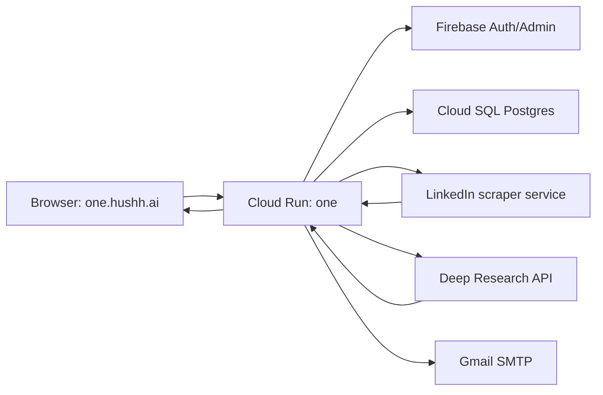
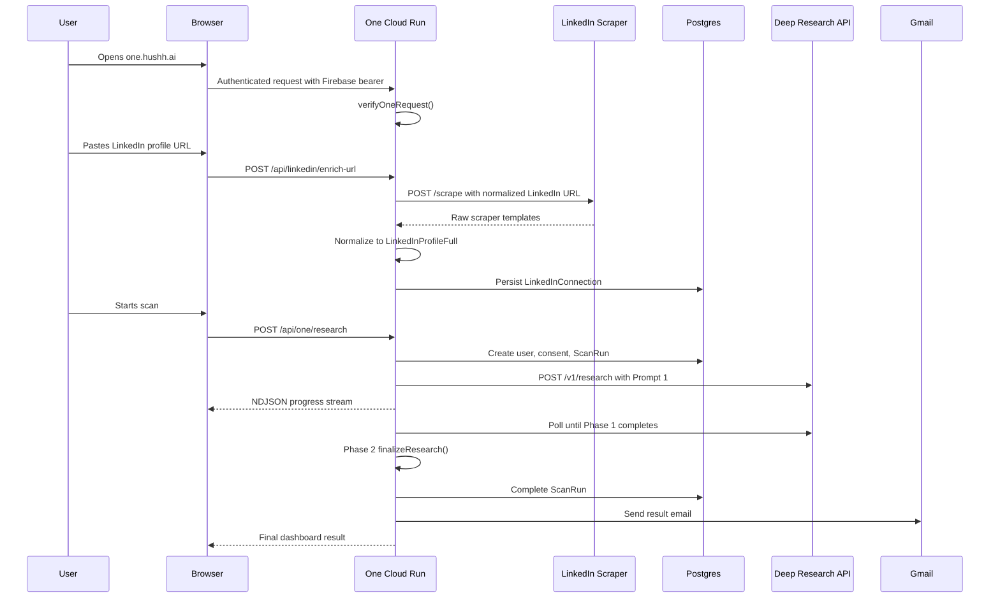

# One Architecture

This is the architecture README for One, the Hushh public-footprint self-audit product at `https://one.hushh.ai`.

The current production app is a Next.js 16 App Router service deployed as a Docker container on Google Cloud Run. Users sign in, connect a LinkedIn profile URL, One normalizes that LinkedIn data into a trusted profile object, then starts a multi-stage public-intelligence scan backed by the Deep Research API and stored in Postgres.

## Production Services

| Layer | Production value |
| --- | --- |
| User-facing URL | `https://one.hushh.ai` |
| GCP project | `hushone-app` |
| Cloud Run service | `one` |
| Current deployed revision | `one-00061-q56` |
| Container image | `us-central1-docker.pkg.dev/hushone-app/cloud-run-source-deploy/one:linkedin-enrichment-20260612171427` |
| Database | Cloud SQL Postgres: `hushone-app:us-central1:hushh-identity-pg` |
| LinkedIn scraper host | `https://linkedin-scraper.136.114.82.27.sslip.io` |
| Deep Research API default | `https://deep-research-api-bmrh3cdxwa-el.a.run.app` unless overridden by env |
| Email provider | Gmail SMTP/app-password env through Secret Manager |

## High-Level System



## Core Runtime Paths

| Concern | Code |
| --- | --- |
| Main app shell | `src/components/one/OneExperience.tsx` |
| LinkedIn URL enrichment route | `src/app/api/linkedin/enrich-url/route.ts` |
| LinkedIn scraper mapper | `src/lib/linkedin/scraper-profile.ts` |
| Standalone LinkedIn scraper worker | `services/linkedin-scraper` |
| LinkedIn profile contract | `src/lib/linkedin/profile.ts` |
| LinkedIn connection persistence | `src/lib/linkedin/connection.ts` |
| Main Phase 1 scan route | `src/app/api/one/research/route.ts` |
| Scan recovery route | `src/app/api/one/research/[id]/route.ts` |
| Progressive deep batches | `src/app/api/one/research/[id]/deep/route.ts` |
| Image intelligence tier | `src/app/api/one/research/[id]/image/route.ts` |
| Prompt builders and result mapper | `src/lib/research/dossier.ts` |
| Deep Research API client | `src/lib/research/client.ts` |
| Phase 2 final synthesis | `src/lib/research/finalize.ts` |
| DB scan/user/notification store | `src/lib/db/scan-store.ts` |
| Gmail result email | `src/lib/notifications/scan-email.ts` |
| Auth verification | `src/lib/auth/verify.ts` |

## User Journey



## Auth Model

One routes expect a Firebase bearer token in the `Authorization` header. `verifyOneRequest()` validates that token and returns a stable user identity:

- `uid`
- `email`
- `name`
- `picture`

There is a development bypass guarded by `ONE_ENABLE_DEV_AUTH`, but production smoke verifies that `DEV_TOKEN` is rejected in production.

LinkedIn URL enrichment is not a public anonymous API. `POST /api/linkedin/enrich-url` verifies the One request before it calls the upstream scraper.

## LinkedIn Enrichment

One uses LinkedIn as the identity and career anchor before starting Phase 1.

Flow:

1. Browser sends a LinkedIn `/in/` URL to `POST /api/linkedin/enrich-url`.
2. One verifies the Firebase bearer token.
3. `scrapeLinkedInProfileUrl()` normalizes the URL.
4. One calls the scraper: `POST ${LINKEDIN_SCRAPER_URL}/scrape`.
5. The upstream returns templates such as `linkedinProfileScraper` and `staffSpyStyle`.
6. `mapScraperResponseToLinkedInProfile()` maps those templates into `LinkedInProfileFull`.
7. `persistConnectedProfile()` saves it to `LinkedInConnection.profile`.
8. `/api/one/research` requires this URL-enriched LinkedIn profile before Deep Research starts.

The scraper API key is server-only. It must never be shipped to the browser, printed in logs, or committed.

See `docs/linkedin-enrichment.md` for the full app contract and `services/linkedin-scraper/README.md` for the standalone worker runtime/deploy guide.

## LinkedIn Data Contract

The normalized profile can include:

- identity: `sub`, `name`, `givenName`, `familyName`, signed-in `email`
- media/profile: `pictureUrl`, `profileUrl`, `headline`
- context: `location`, `about`
- structured career: `experience[]`
- structured education: `education[]`
- skills and certifications
- optional public stats: `profileStats`
- provenance: `source: "scraper"` and `grantedScopes`

Important behavior:

- `· 2nd`, `· 3rd`, buttons, and `More profiles for you` are LinkedIn UI noise, not profile facts.
- If the top-card title is only connection-degree text, One derives the headline from real current experience, for example `Developer at Oracle`.
- Sidebar/recommendation leakage is stripped before it reaches Prompt 1.
- Raw scraper/session/cookie data is intentionally excluded from Prompt 1.

## Prompt 1 Handoff

`buildPersonDossierQuestion()` builds the Phase 1 prompt in `src/lib/research/dossier.ts`.

When LinkedIn data is present, Prompt 1 includes:

- `SUBJECT_INTELLIGENCE_CONTEXT_JSON`
- `LINKEDIN_ENRICHED_PROFILE_JSON`
- a professional spine derived from structured LinkedIn experience first
- a headline parser fallback only when structured experience is missing

Prompt 1 instructs Deep Research to:

- treat LinkedIn/user-provided JSON as locked ground truth for identity and self-declared career facts
- avoid fetching or citing signed LinkedIn/media URLs
- reject same-name people unless they connect to the LinkedIn JSON or other strong anchors
- use public web only for corroboration, contradictions, and enrichment
- label claims as LinkedIn ground truth, public web evidence, or inference

## Scan Lifecycle

`POST /api/one/research` is the main scan route.

Phase 0:

- Verify Firebase token.
- Parse and sanitize the request body.
- Require a URL-enriched LinkedIn profile.
- Create/update `OneUser`.
- Create `ConsentEvent` and `ScanRun`.

Phase 1:

- Build Prompt 1.
- Call `startResearch(question, depth)`.
- Store `deepResearchJobId`.
- Stream NDJSON progress to the browser.
- Poll the Deep Research job until completion.

Phase 2:

- Run `finalizeResearch()` to turn the raw Phase 1 report into One's dashboard result shape.
- Persist `normalizedResult`, `summary`, timings, and outcome.
- Send result emails.

Recovery:

- If the browser disconnects or the route hits a soft deadline, the scan remains recoverable.
- `GET /api/one/research/[id]` resumes polling/finalization using the stored `deepResearchJobId`.
- `GET /api/one/scans/latest` lets the browser reattach to the most recent scan.

## Local Discovery

Local Discovery is a real-time, location-aware discovery feed that streams nearby results as each category resolves. It is **additive**: it ships as a new `/discovery` experience alongside — not replacing — the classic `/localfinder` directory-table view, which remains as the fallback. (The earlier `/discover` path permanently redirects (308) to `/discovery` via `next.config.ts`, so any pre-launch links keep working.)

It covers four categories, one per coordinate vertical in the directory: **hotels**, **healthcare**, **ria** (SEC-registered investment adviser firms), and **insurance** (state-licensed producers). Every category streams over the same SSE contract, so "user drops a pin → advisers, insurance agents, clinics and hotels arrive progressively" is one request.

> **Naming trap:** `src/lib/ria/` is **not** this. That directory is the RIA Shadow person-intelligence client (`RIA_INTELLIGENCE_API_BASE_URL`, see `docs/RIA_SHADOW_STREAMING_SPEC.md`) — an unrelated subsystem that happens to share the acronym. The registered-investment-adviser code is `src/lib/local-discovery/adapters/ria.ts` and the `ria` vertical in `src/lib/directory/`.

Unlike the ZIP/coordinate directory API (`GET /api/v1/directory`), which returns a single stored-data snapshot, Local Discovery is a streaming API that fans out to our own PostGIS directory (seed) **and** live enrichment in parallel, merges/dedupes/ranks the two, and pushes results to the browser progressively over SSE.

### Public surface

Same-origin, unauthenticated but per-IP rate-limited (this is UI plumbing, not the Bearer-gated `/api/v1` developer API):

| Concern | Endpoint |
| --- | --- |
| Start a search | `POST /api/local-discovery/search` → `202 { ok, searchId, query, warnings, links:{ self, events, stream }, spend }` |
| Live event stream | `GET /api/local-discovery/search/{searchId}/events` (SSE) |

The client POSTs `{ lat, lng }` **or** `{ postalCode, countryCode }` plus optional `radius` / `categories` / `sort` / `limit` / filters, then opens an `EventSource` on the returned `links.stream`. That stream link carries the **resolved** lat/lng as query params, so a different Cloud Run instance can rebuild an equivalent session (the ledger and session state live on `globalThis`, i.e. per-instance).

Named SSE events (each frame's `data` is the full event object): `search_started`, `category_started`, `category_results` (per category, with a `status` of `done` / `degraded` / `error`), `category_error`, and `search_complete`. The stream also emits a `ping` heartbeat (~7s) and a `timeout` frame. The client **closes the `EventSource` on `search_complete`** to defeat the browser's auto-reconnect, and settles on the server's authoritative merged+ranked list from that final frame.

### Category adapters (seed + live, failure-isolated)

Every category runs the same `shared.ts` pipeline: **seed → enrich → merge/dedupe → rank**. The two data sources run under `Promise.allSettled`, so either can fail independently and the search degrades rather than throwing:

- **Seed** — proximity query against our own PostGIS directory (`src/lib/directory`, `queryVertical`), guarded by `hasDirectoryDb()`. No DB wired → zero seed rows + a warning (live-only). Each adapter declares its `seedVertical`, or `null` when the registry doesn't cover the search country (e.g. US-only NPPES for a non-US search — never seed misleading data).
- **Live** — Google Places, budget-gated (see guardrails). No key or over-budget → skipped, results marked `degraded` with a warning; the frontend surfaces a "showing saved results" indicator.

An adapter is ~20 lines because it only picks four knobs: `seedVertical`, `placeTypes`, an optional `textQuery`, and its honesty warnings.

| Category | Registry seed | Live Places enrichment |
| --- | --- | --- |
| `hotels` | `hotels` (rooftop coords, crawler-sourced) | Nearby, `lodging` |
| `healthcare` | `healthcare` — NPPES, **US only** | Nearby, `doctor` + `hospital` |
| `ria` | `ria` — SEC IAPD Form ADV, **US only** | **Text Search** — no Table A type exists |
| `insurance` | `insurance` — state DOI licences, **US only** | Nearby, `insurance_agency` |

**Why RIA uses Text Search.** `includedTypes` accepts Google Places (New) **Table A** types only — an unlisted value is a hard `400 INVALID_ARGUMENT` from `places:searchNearby`. Table A's entire Finance category is `accounting`, `atm`, `bank`; none of them describe an investment adviser. So the RIA adapter leaves `placeTypes` empty and sets a baseline `textQuery`, which routes `providers/places.ts` to `places:searchText`. A user's free-text refine is **appended** to that baseline, never substituted for it. `insurance_agency` *is* a real Table A type (Services category), so insurance keeps the cheaper, distance-ranked Nearby path. `shared.ts` refuses to call Places at all when a config has neither `placeTypes` nor `textQuery` — otherwise an untyped Nearby search would return every business in the radius.

**Registry honesty.** Three of the four verticals are US registries and are geo-tagged from a **ZIP centroid**, not a real address (see the `geoPrecision` contract below). Two category-specific caveats are surfaced as warnings rather than left implicit:

- `ria` seeds the SEC **`firms`** table only. Individual advisers in the Form ADV feed almost never carry a mappable address (`geog` is NULL), so a proximity query cannot return them. The feed answers "adviser **firms** near you", and the UI label says `RIA firms` for that reason.
- `insurance` coverage is **state-by-state**, because there is no free national producer file (NIPR's Producer Database is paid). A search in a state whose DOI publishes no free bulk export gets zero seed rows. `seedEmptyWarning` fires when the seed query *ran and returned nothing*, so an uncovered state reads as a coverage gap rather than "there are no agents here". It is driven by the empty result, **not** a hardcoded list of covered states, so it can't go stale as states are unblocked in `services/insurance-directory`.

### Unified profile contract

Adapters normalize both sources into one `UnifiedProfile` (`src/lib/local-discovery/types.ts`, client-safe): namespaced IDs, **per-field source attribution**, a `quality` tier (`rich` / `standard` / `basic` / `insufficient`) with a numeric `qualityScore`, and `distanceApproximate` / `approximateLocation` flags (true for ZIP-centroid or postal-resolved origins, so the UI shows `~` distances and never a misleading `0 m`).

### Location resolution

`src/lib/local-discovery/location.ts` accepts coordinates directly, or resolves `postalCode + countryCode` via the geocoding provider. With no geocoding key, postal input returns `422 postal_unresolved` with an actionable message (send lat/lng instead). The resolved query records `resolvedFrom: "coordinates" | "postal"` and `approximateOrigin`.

### Cost + reliability guardrails (before any paid call)

- **Spend ledger** (`spend.ts`): daily USD budget `LOCAL_DISCOVERY_DAILY_BUDGET_USD` (default **25**) and a per-request paid-call cap `LOCAL_DISCOVERY_MAX_PAID_CALLS_PER_REQUEST` (default **6**). Paid providers are gated behind `LOCAL_DISCOVERY_ALLOW_PAID`. The `spend` snapshot is echoed on every `POST` response. **Headroom note:** an all-categories search now costs up to 4 Places calls + 1 geocode = **5 of 6**. Adding a fifth category, or a second paid call per adapter, exceeds the default cap — and because adapters race under `Promise.allSettled`, *which* category loses live enrichment would be nondeterministic. Raise the cap in the same change that adds the category.
- **Reliability primitives** (`reliability.ts`): per-provider token-bucket rate limits, per-provider circuit breakers (open after 5 consecutive failures, 30s cooldown), per-call timeouts, bounded exponential backoff with jitter, and a concurrency gate. An open breaker or rate-limit skips that provider and degrades to seed/cache.
- **Caching + ToS** (`cache.ts`): short-lived search + entity caches. Google Places fields respect the provider's no-cache posture and attribution requirement (the `/discovery` UI renders Google attribution whenever a profile used Places).

### Frontend

`/discovery` is a server page (`src/app/discovery/page.tsx`) + a client island (`Discovery.tsx`) mirroring the `/localfinder` pattern, styled monochrome + Lexend via a scoped CSS module. It offers GPS or postal input, radius / category / min-rating / open-now / free-text refine filters, and four sort orders. Each category renders in an independent loading lane (skeletons + a status strip) while in flight, then the grid settles on the authoritative list at `search_complete`. A `runSeq` ref discards superseded runs.

### Code paths

| Concern | Code |
| --- | --- |
| Types + contracts (client-safe) | `src/lib/local-discovery/types.ts` |
| Search orchestration + SSE session | `src/lib/local-discovery/orchestrator.ts` |
| Start route (202) | `src/app/api/local-discovery/search/route.ts` |
| SSE events route | `src/app/api/local-discovery/search/[searchId]/events/route.ts` |
| Category adapter pipeline | `src/lib/local-discovery/adapters/shared.ts` (+ `hotels.ts`, `healthcare.ts`, `ria.ts`, `insurance.ts`) |
| Directory seed | `src/lib/directory/query.ts`, `src/lib/directory/db.ts` |
| Live providers | `src/lib/local-discovery/providers/places.ts`, `geocoding.ts` |
| Location resolution | `src/lib/local-discovery/location.ts` |
| Normalize / merge / quality / rank | `src/lib/local-discovery/{normalize,merge,quality,rank}.ts` |
| Spend + reliability + cache | `src/lib/local-discovery/{spend,reliability,cache}.ts` |
| Frontend | `src/app/discovery/{page.tsx,Discovery.tsx,discovery.module.css}` (route `/discovery`; `/discover` → `/discovery` 308 redirect in `next.config.ts`) |

### Environment names

- Live enrichment: `PLACES_API_KEY` (falls back to `GOOGLE_MAPS_API_KEY`).
- Geocoding (postal → coords): `GEOCODING_API_KEY` (falls back to `GOOGLE_MAPS_API_KEY`, then `PLACES_API_KEY`).
- Guardrails: `LOCAL_DISCOVERY_ALLOW_PAID`, `LOCAL_DISCOVERY_DAILY_BUDGET_USD`, `LOCAL_DISCOVERY_MAX_PAID_CALLS_PER_REQUEST`.
- Directory seed reuses the directories DB wiring (`DIRECTORIES_DB_*`, secret `directories-ro-db-password`).

With none of the paid keys set (e.g. the `one-mock` launch config), Local Discovery still runs end-to-end: it streams the full SSE lifecycle and returns seed-only or empty results tagged `degraded` with explanatory warnings, never a hard failure.

## Data Model

Main Prisma models:

- `OneUser`: user identity keyed by `firebaseUid`.
- `LinkedInConnection`: one connected normalized LinkedIn profile per user.
- `ConsentEvent`: durable consent/location-mode audit row per scan start.
- `ScanRun`: scan input, status, result, timings, outcome, and Deep Research job ID.
- `AuditJob`: optional legacy/adjacent audit job records.
- `OneNotification`: email send tracking for user/admin result delivery.
- `DataRequest`: account/data request lifecycle.

`ScanRun.input` stores the sanitized request input, including `linkedinProfile` and `deepResearchJobId`. `ScanRun.normalizedResult` stores the dashboard-ready result.

## Environment And Secrets

Production env names currently used by the service include:

- Firebase public env:
  - `NEXT_PUBLIC_FIREBASE_API_KEY`
  - `NEXT_PUBLIC_FIREBASE_APP_ID`
  - `NEXT_PUBLIC_FIREBASE_AUTH_DOMAIN`
  - `NEXT_PUBLIC_FIREBASE_MESSAGING_SENDER_ID`
  - `NEXT_PUBLIC_FIREBASE_PROJECT_ID`
  - `NEXT_PUBLIC_FIREBASE_STORAGE_BUCKET`
- Auth/runtime:
  - `ONE_ENABLE_DEV_AUTH`
  - `NEXT_PUBLIC_ONE_ENABLE_DEV_AUTH`
  - `GOOGLE_CLOUD_PROJECT`
- Database:
  - `DATABASE_URL`
- Deep Research:
  - `DEEP_RESEARCH_API_TOKEN`
  - `DEEP_RESEARCH_DEPTH`
  - `DEEP_RESEARCH_API_BASE_URL` if overriding the default
- LinkedIn OAuth:
  - `LINKEDIN_REDIRECT_URI`
  - `LINKEDIN_CLIENT_ID`
  - `LINKEDIN_CLIENT_SECRET`
- LinkedIn URL enrichment:
  - `LINKEDIN_SCRAPER_URL`
  - `LINKEDIN_SCRAPER_API_KEY`
  - `LINKEDIN_SCRAPER_TIMEOUT_MS`
- Email:
  - `GMAIL_USER`
  - `GMAIL_APP_PASSWORD`
  - `ONE_SITE_URL`
- Legacy/RIA compatibility:
  - `PERSON_INTELLIGENCE_API_KEY`
  - `RIA_INTELLIGENCE_API_BASE_URL`
  - `ONE_RIA_TIMEOUT_MS`
  - `ONE_SHADOW_TIMEOUT_MS`
  - `ONE_SHADOW_RETRIES`

Never expose secret values in docs, logs, screenshots, or browser bundles. Give names and Secret Manager locations only.

## Deployment

The app uses `next.config.ts` with `output: "standalone"` and a multi-stage Dockerfile.

Local preflight:

```bash
npm run typecheck
npm run lint
npm test
npm run build
```

Build and push a production image:

```bash
IMAGE="us-central1-docker.pkg.dev/hushone-app/cloud-run-source-deploy/one:<tag>"
gcloud builds submit --project=hushone-app --tag "$IMAGE" .
```

Deploy to Cloud Run:

```bash
gcloud run deploy one \
  --project=hushone-app \
  --region=us-central1 \
  --image "$IMAGE" \
  --platform=managed \
  --quiet
```

Check deployed revision and env names:

```bash
gcloud run services describe one \
  --project=hushone-app \
  --region=us-central1 \
  --format='json(status.latestReadyRevisionName,status.traffic,spec.template.spec.containers[0].image,spec.template.spec.containers[0].env)'
```

## Verification

Production smoke:

```bash
BASE_URL=https://one.hushh.ai node scripts/prod-smoke.mjs
```

Expected current smoke coverage:

- homepage returns 200
- homepage renders One
- scan/dashboard APIs require auth
- dev auth is off in production
- events beacon accepts valid events and ignores unknown events
- wrong method on scan API returns 405

LinkedIn route auth smoke:

```bash
curl -sS -X POST https://one.hushh.ai/api/linkedin/enrich-url \
  -H 'Content-Type: application/json' \
  --data '{"url":"https://www.linkedin.com/in/example/"}'
```

Expected without a Firebase bearer: `401 Missing authorization header`.

## Observability

Cloud Logging query for the live service:

```bash
gcloud logging read \
  'resource.type="cloud_run_revision" AND resource.labels.service_name="one" AND timestamp>="YYYY-MM-DDTHH:MM:SSZ"' \
  --project=hushone-app \
  --limit=100 \
  --order=desc
```

Important structured events:

- `one.ui.stage_*`: browser funnel events
- `one.ui.linkedin_connect_started`
- `one.ui.linkedin_connected`
- `one.research.phase1_done`
- `one.research.synth_ok`
- `one.research.completed`
- `one.research.failed`
- `one.research.deadline`
- `one.research_email.failed`

Dashboard and alert definitions live under `observability/`.

## Failure Modes

LinkedIn enrichment:

- `401` from One route means missing/invalid Firebase bearer.
- `linkedin_scraper_not_configured` means `LINKEDIN_SCRAPER_API_KEY` is missing.
- `linkedin_scraper_timeout` means the scraper exceeded `LINKEDIN_SCRAPER_TIMEOUT_MS`.
- Authwall/checkpoint/session errors usually mean the upstream LinkedIn session needs attention.
- Sparse profile output should still gracefully preserve any real about, experience, education, skills, certifications, and profile stats.

Deep Research:

- Missing token returns `Deep Research API token is not configured`.
- Upstream 429/5xx is retried by `src/lib/research/client.ts`.
- Long Phase 1 scans can hand off to recovery instead of losing the job.

Database:

- Timing columns are treated defensively because deploys may run before migrations in some environments.
- `LinkedInConnection` reads/writes are defensive so missing migration state does not break connect.

Email:

- Email send failures are logged and tracked, but the scan result can still complete.

## Security And Privacy Boundaries

- Use only user-consented inputs and lawful public web data.
- Do not expose raw LinkedIn sessions, cookies, scraper keys, SMTP passwords, database URLs, or Firebase admin material.
- Do not fetch/cite signed LinkedIn media URLs in Deep Research output.
- Do not report exact home address, private messages, leaked secrets, private family/minor details, or non-consented private account data.
- Prefer `unknown` over guessing.

## Related Docs

- `docs/linkedin-enrichment.md`
- `docs/RIA_SHADOW_STREAMING_SPEC.md`
- `README.md`
- `CONTEXT.md`
