# Instagram URL Enrichment

This document describes the optional Instagram profile enrichment path used by One before starting Phase 1 Deep Research.

## Production Shape

- One route: `POST /api/instagram/enrich-url`
- Standalone worker code: `services/instagram-scraper`
- Worker VM: `instagram-scraper-vm`
- Worker GCP project: `hushh-tech-prod`
- Worker API paths: `POST /scrape`, `POST /access-request`, `POST /access-check`
- Worker request body: `{ "url": "<normalized instagram.com profile URL>" }`
- Worker auth: `Authorization: Bearer <INSTAGRAM_SCRAPER_API_KEY>`
- VM Chromium profile: `/var/lib/instagram-scraper/chrome-profile`
- VM output dir: `/var/lib/instagram-scraper/outputs`

The browser never receives the scraper API key. The browser sends only an Instagram profile URL to One, and One performs the worker call server-side after verifying the signed-in One user.

Instagram is optional. LinkedIn remains mandatory and is still the identity/career ground truth for Phase 1.

## Runtime Flow

```mermaid
flowchart LR
  User["User gives Instagram URL"] --> One["One app"]
  One --> API["/api/instagram/enrich-url"]
  API --> Auth["Verify Firebase user"]
  Auth --> Worker["Instagram scraper service"]
  Worker --> Chrome["VM Chromium persistent session"]
  Chrome --> IG["instagram.com profile"]
  IG --> State["Classify access state"]
  State --> Request["Private: one-time Follow/Request"]
  State --> Extract["Extract visible profile data"]
  Request --> Pending["Persist pending access"]
  Extract --> Clean["Normalize InstagramProfileFull"]
  Pending --> DB["Persist social profile/access state"]
  Clean --> DB["Persist social profile/access state"]
  DB --> DR["Phase 1 social context"]
```



## Environment

Set these on the One app runtime:

```bash
INSTAGRAM_SCRAPER_URL=https://<instagram-scraper-host>
INSTAGRAM_SCRAPER_API_KEY=<Secret Manager: instagram-scraper-api-key>
INSTAGRAM_SCRAPER_TIMEOUT_MS=120000
```

Do not print, commit, or expose `INSTAGRAM_SCRAPER_API_KEY`.

## Accepted Input

Only direct profile URLs are accepted:

```text
https://www.instagram.com/ankit_ya_i_am/
```

The normalizer rejects posts, reels, stories, explore, login/checkpoint paths, and non-Instagram URLs.

## Normalized Payload

`InstagramProfileFull` includes bounded public fields only:

```ts
{
  platform: "Instagram";
  username: string;
  displayName: string | null;
  bio: string | null;
  avatarUrl: string | null;
  externalUrl: string | null;
  profileUrl: string;
  isVerified?: boolean;
  isPrivate?: boolean;
  stats?: {
    posts?: string | null;
    followers?: string | null;
    following?: string | null;
  };
  recentPublicPosts?: Array<{
    url: string;
    kind?: "post" | "reel";
    position?: number;
    caption?: string | null;
    thumbnailUrl?: string | null;
    cdnUrls?: string[];
    alt?: string | null;
    ariaLabel?: string | null;
    isCarousel?: boolean;
    isVideo?: boolean;
    timestamp?: string | null;
    likes?: string | null;
    comments?: string | null;
    visibleText?: string | null;
  }>;
  highlights?: Array<{
    title: string;
    url?: string | null;
    thumbnailUrl?: string | null;
  }>;
  access?: {
    state:
      | "public_visible"
      | "private_not_following"
      | "follow_requested"
      | "pending_approval"
      | "approved_visible"
      | "login_required"
      | "checkpoint_required"
      | "rate_limited"
      | "blocked"
      | "not_found";
    canScrapePosts?: boolean;
    isPrivate?: boolean;
    following?: boolean;
    outgoingRequest?: boolean;
    canRequest?: boolean;
    checkedAt?: string;
    nextCheckAfter?: string | null;
  };
  visibleProfileText?: string[];
  source: "scraper";
}
```

Raw scraper/session/cookie material is intentionally excluded from One responses, persistence, and Phase 1 prompts. Grid collection is profile-page bounded by `INSTAGRAM_MAX_POSTS_PER_PROFILE`; it does not open DMs, follower lists, or stories.

## Private Profile Access

Private profiles use a durable, one-time request lifecycle:

1. `/scrape` or `/access-request` opens the profile in VM Chromium.
2. If the profile is private and exposes `Follow`, the worker clicks it once.
3. The worker returns `follow_requested` or `pending_approval` and stores an access audit file under the worker output dir.
4. One stores the same state in `SocialAccessRequest`; the normal One flow continues without Instagram.
5. Later `/access-check` or another `/scrape` checks whether the VM account can see the grid. If approved, One persists the full visible profile as a `SocialConnection`.

No owner approval means no private post/CDN access. The scraper does not bypass approval, checkpoints, login walls, or rate-limit screens.

## Prompt 1 Handoff

`/api/one/research` sanitizes `socialProfiles`, folds valid Instagram URLs into `confirmedProfiles`, stores them in `ScanRun.input`, and passes them to `buildPersonDossierQuestion()`.

Prompt 1 includes:

- `SUBJECT_INTELLIGENCE_CONTEXT_JSON`
- `LINKEDIN_ENRICHED_PROFILE_JSON`
- `SOCIAL_ENRICHED_PROFILES_JSON` when Instagram was added

The prompt explicitly treats Instagram as supporting social context only. It can seed cross-platform discovery, but it is not proof of identity, career, education, private activity, or employment.

## noVNC / Session Model

In VM mode, Chromium runs with a persistent user-data directory and Chrome DevTools on `127.0.0.1:9222`. A human uses noVNC only for first login, expired sessions, 2FA, CAPTCHA, or checkpoint recovery. Normal scrape requests run silently through Puppeteer.

The scraper does not bypass Instagram challenges. If Instagram presents a login wall or checkpoint and the VM session cannot pass it, the worker returns a controlled authwall response and One lets the user continue without Instagram.

For the LinkedIn-style human login flow:

```bash
cd services/instagram-scraper
PROJECT=hushh-tech-prod ./scripts/gcp-vm/open-login-browser.sh
```

Keep the printed SSH tunnel running, then open `http://127.0.0.1:8080/login-intent`. The intent page is local-only and points to the tunneled noVNC desktop. Log in to Instagram inside VM Chromium, leave the browser open, and retry `POST /scrape`. Actual grid thumbnails/CDN URLs are returned only when the logged-in VM browser can see that profile page.

The worker also exposes `GET /session/status` behind `SCRAPER_API_KEY` so ops can confirm the live-browser mode, noVNC URL, DevTools URL, and Chrome profile path without exposing cookies or secrets.

## Key Files

- `services/instagram-scraper/README.md`
- `services/instagram-scraper/server.mjs`
- `services/instagram-scraper/scripts/lib/live-browser-scraper.mjs`
- `services/instagram-scraper/scripts/gcp-vm/deploy-gcp-vm.sh`
- `src/app/api/instagram/enrich-url/route.ts`
- `src/app/api/instagram/profile/route.ts`
- `src/lib/instagram/scraper-profile.ts`
- `src/lib/instagram/profile.ts`
- `src/lib/auth/identity.ts`
- `src/app/api/one/research/route.ts`
- `src/lib/research/dossier.ts`

## Tests

```bash
npm test -- src/lib/auth/identity.test.ts src/app/api/instagram/enrich-url/route.test.ts src/app/api/one/research/route.test.ts src/lib/research/dossier.test.ts

cd services/instagram-scraper
npm test
```
