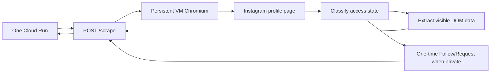

# HusshOne Instagram Scraper Service

Standalone HTTP service for optional Instagram URL enrichment in One.

The service accepts an Instagram public profile URL, reads the profile through Chromium, and returns bounded public profile metadata. It uses the same persistent-browser architecture as the LinkedIn scraper, but it does not make Instagram mandatory for Send One.

For private profiles, the worker uses the logged-in VM Chromium session to send one `Follow` / request action when the profile exposes that button. It then persists a pending access state and polls/checks later; it does not repeatedly click or bypass owner approval.

Secrets, cookies, raw outputs, and noVNC logs are intentionally ignored and must not be committed.

## Runtime Model



In VM mode, Chromium starts once with a persistent profile and remote debugging enabled on `127.0.0.1:9222`. A human completes Instagram login through noVNC only when Instagram asks for login, 2FA, CAPTCHA, or checkpoint handling. The scraper does not bypass those challenges.

## API

Health:

```bash
curl http://localhost:8080/health
```

Session status:

```bash
curl -sS \
  -H "Authorization: Bearer $SCRAPER_API_KEY" \
  http://localhost:8080/session/status
```

Local login intent page:

```text
http://127.0.0.1:8080/login-intent
```

`/login-intent` is intentionally local-only. Open it through an SSH tunnel to the VM API port, then use the noVNC link on the page to complete Instagram login or checkpoint handling in the persistent VM Chromium session.

Scrape one profile:

```bash
curl -sS \
  -H "Authorization: Bearer $SCRAPER_API_KEY" \
  -H "Content-Type: application/json" \
  -d '{"url":"https://www.instagram.com/ankit_ya_i_am/"}' \
  http://localhost:8080/scrape
```

Request private access once:

```bash
curl -sS \
  -H "Authorization: Bearer $SCRAPER_API_KEY" \
  -H "Content-Type: application/json" \
  -d '{"url":"https://www.instagram.com/sumitsoni922/"}' \
  http://localhost:8080/access-request
```

Check access without clicking Follow:

```bash
curl -sS \
  -H "Authorization: Bearer $SCRAPER_API_KEY" \
  -H "Content-Type: application/json" \
  -d '{"url":"https://www.instagram.com/sumitsoni922/"}' \
  http://localhost:8080/access-check
```

Only direct Instagram profile URLs are accepted. Posts, reels, stories, explore, login, and other app paths are rejected.

Access states returned in `results[].access.state`:

```text
public_visible
private_not_following
follow_requested
pending_approval
approved_visible
login_required
checkpoint_required
rate_limited
blocked
not_found
```

## Environment

| Variable | Default | Purpose |
| --- | --- | --- |
| `PORT` | `8080` | HTTP API port |
| `SCRAPER_API_KEY` | empty | Optional bearer token; required in deployed environments |
| `OUTPUT_DIR` | `outputs/api` | Local copy of raw result JSON |
| `INSTAGRAM_MAX_URLS_PER_REQUEST` | `3` | Batch cap |
| `INSTAGRAM_LIVE_BROWSER` | `false` | Connect to existing Chromium via DevTools |
| `INSTAGRAM_BROWSER_URL` | `http://127.0.0.1:9222` | DevTools endpoint for the live browser |
| `INSTAGRAM_NOVNC_URL` | `http://127.0.0.1:6080/vnc.html?host=127.0.0.1&port=6080` | Local/tunneled noVNC URL shown on `/login-intent` |
| `PUPPETEER_EXECUTABLE_PATH` | `/usr/bin/chromium` | Chromium binary path |
| `PUPPETEER_USER_DATA_DIR` | unset | Persistent profile directory |
| `INSTAGRAM_PROFILE_SCRAPER_TIMEOUT_MS` | `120000` | Page/navigation timeout |
| `INSTAGRAM_PROFILE_SCRAPER_HEADLESS` | `true` | Launch mode when not using live browser |
| `INSTAGRAM_MAX_POSTS_PER_PROFILE` | `120` | Max visible grid posts/reels to collect from the profile page |

## Local Run

```bash
cd services/instagram-scraper
npm install
SCRAPER_API_KEY=dev-key npm start
```

For local live-browser mode, start Chrome separately:

```bash
"/Applications/Google Chrome.app/Contents/MacOS/Google Chrome" \
  --user-data-dir="$PWD/.chrome-profile" \
  --remote-debugging-address=127.0.0.1 \
  --remote-debugging-port=9222 \
  --no-first-run \
  --disable-dev-shm-usage \
  https://www.instagram.com/
```

Then run:

```bash
SCRAPER_API_KEY=dev-key \
INSTAGRAM_LIVE_BROWSER=true \
INSTAGRAM_BROWSER_URL=http://127.0.0.1:9222 \
npm start
```

## GCP VM Deployment

```bash
cd services/instagram-scraper
PROJECT=hushh-tech-prod ./scripts/gcp-vm/deploy-gcp-vm.sh
```

If Instagram expires or checkpoints the session:

```bash
PROJECT=hushh-tech-prod ./scripts/gcp-vm/open-login-browser.sh
```

The helper restarts the VM login browser and prints a tunnel command. Keep that tunnel running, open:

```text
http://127.0.0.1:8080/login-intent
```

Then click noVNC, complete Instagram login/checkpoint in the VM Chrome window, leave Chrome open, and retry the scrape. This is the same persistent-session shape as the LinkedIn scraper: login happens once in VM Chromium, normal API requests reuse that Chromium profile silently.

Smoke the VM API:

```bash
PROJECT=hushh-tech-prod ./scripts/gcp-vm/test-vm-api.sh "https://www.instagram.com/ankit_ya_i_am/"
```

## One Integration

In the One app, set:

```bash
INSTAGRAM_SCRAPER_URL=https://<instagram-scraper-host>
INSTAGRAM_SCRAPER_API_KEY=<Secret Manager: instagram-scraper-api-key>
INSTAGRAM_SCRAPER_TIMEOUT_MS=120000
```

The browser never receives the scraper key. One calls this service from `POST /api/instagram/enrich-url`, maps the response into `InstagramProfileFull`, persists it as a social profile, and passes it into Phase 1 as optional social context.

## Boundaries

- Instagram is optional; LinkedIn remains the mandatory identity/career anchor.
- Read only profile-page metadata visible to the logged-in VM browser session: username, display name, bio, avatar, counts, external link, highlight chips, visible grid post/reel links, thumbnails/CDN URLs, alt text, carousel/video flags, timestamps, and visible hover metrics when Instagram renders them.
- Private profiles send at most one Follow/Request action, then return `follow_requested` / `pending_approval` until the owner approves.
- Do not read DMs, stories, follower lists, or any data not visible to the VM account on the profile page.
- A private pending state, login wall, checkpoint, or sparse result returns a controlled response and should not block Send One.

## Tests

```bash
cd services/instagram-scraper
npm test
```
