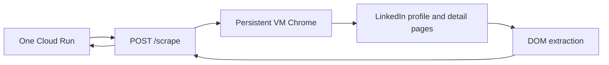

# HusshOne LinkedIn Scraper Service

Standalone HTTP service for the LinkedIn URL enrichment worker used by One.

The service accepts a LinkedIn personal profile URL, reads it through a logged-in Chrome session, and returns the two raw templates that the One app maps into `LinkedInProfileFull`:

- `templates.linkedinProfileScraper`
- `templates.staffSpyStyle`

Secrets, cookies, raw outputs, and noVNC logs are intentionally ignored and must not be committed.

## Runtime Model



In production-like VM mode, Chrome is started once with a persistent profile and remote debugging enabled on `127.0.0.1:9222`. A human completes LinkedIn login through noVNC when LinkedIn asks for password, 2FA, CAPTCHA, or checkpoint handling. The scraper does not bypass those challenges.

## API

Health:

```bash
curl http://localhost:8080/health
```

Scrape one profile:

```bash
curl -sS \
  -H "Authorization: Bearer $SCRAPER_API_KEY" \
  -H "Content-Type: application/json" \
  -d '{"url":"https://www.linkedin.com/in/example/"}' \
  http://localhost:8080/scrape
```

Scrape a small batch:

```json
{
  "urls": [
    "https://www.linkedin.com/in/person-a/",
    "https://www.linkedin.com/in/person-b/"
  ]
}
```

Only LinkedIn personal `/in/<id>` URLs are accepted.

## Environment

| Variable | Default | Purpose |
| --- | --- | --- |
| `PORT` | `8080` | HTTP API port |
| `SCRAPER_API_KEY` | empty | Optional bearer token; required in deployed environments |
| `OUTPUT_DIR` | `outputs/api` | Local copy of raw result JSON |
| `LINKEDIN_MAX_URLS_PER_REQUEST` | `5` | Batch cap |
| `LINKEDIN_LIVE_BROWSER` | `false` | Use the persistent Chrome/DevTools path |
| `LINKEDIN_BROWSER_URL` | `http://127.0.0.1:9222` | DevTools endpoint for the live browser |
| `LINKEDIN_USE_PERSISTENT_PROFILE` | `false` | Use a saved Chrome profile instead of cookie injection |
| `PUPPETEER_EXECUTABLE_PATH` | `/usr/bin/chromium` | Chromium binary path |
| `PUPPETEER_USER_DATA_DIR` | unset | Persistent profile directory |
| `LINKEDIN_PROFILE_SCRAPER_TIMEOUT_MS` | `90000` | Page/navigation timeout |
| `LINKEDIN_LI_AT` | empty | Optional `li_at` cookie fallback |
| `LINKEDIN_LI_AT_FILE` | `/app/secrets/li_at` | Optional mounted `li_at` file |
| `LINKEDIN_COOKIES_JSON` | empty | Optional full cookie JSON fallback |
| `LINKEDIN_COOKIES_JSON_FILE` | `/app/secrets/linkedin-cookies.json` | Optional mounted cookie JSON file |

## Local Run

```bash
cd services/linkedin-scraper
npm install
SCRAPER_API_KEY=dev-key npm start
```

For live-browser mode, start Chrome separately with remote debugging and a persistent profile:

```bash
chromium \
  --user-data-dir="$PWD/.chrome-profile" \
  --remote-debugging-address=127.0.0.1 \
  --remote-debugging-port=9222 \
  --no-first-run \
  --disable-dev-shm-usage \
  https://www.linkedin.com/feed/
```

Then run:

```bash
SCRAPER_API_KEY=dev-key \
LINKEDIN_LIVE_BROWSER=true \
LINKEDIN_USE_PERSISTENT_PROFILE=true \
LINKEDIN_BROWSER_URL=http://127.0.0.1:9222 \
npm start
```

## GCP VM Deployment

The VM helper creates/updates a Debian VM with:

- Xvfb virtual display
- x11vnc and noVNC for manual login
- persistent Chromium profile
- `linkedin-login-browser` systemd service
- `linkedin-scraper-api` systemd service

```bash
cd services/linkedin-scraper
PROJECT=hushh-tech-prod ./scripts/gcp-vm/deploy-gcp-vm.sh
```

If LinkedIn expires or checkpoints the session:

```bash
PROJECT=hushh-tech-prod ./scripts/gcp-vm/open-login-browser.sh
```

Open the printed noVNC URL, complete LinkedIn login manually, leave Chrome open, and restart the API if needed.

Smoke the VM API:

```bash
PROJECT=hushh-tech-prod ./scripts/gcp-vm/test-vm-api.sh "https://www.linkedin.com/in/example/"
```

## One Integration

In the One app, set:

```bash
LINKEDIN_SCRAPER_URL=https://linkedin-scraper.136.114.82.27.sslip.io
LINKEDIN_SCRAPER_API_KEY=<Secret Manager: linkedin-scraper-api-key>
LINKEDIN_SCRAPER_TIMEOUT_MS=180000
```

The browser never receives the scraper key. One calls this service from `POST /api/linkedin/enrich-url`, maps the response in `src/lib/linkedin/scraper-profile.ts`, and persists the normalized profile.

## Failure Modes

- `401`: missing or incorrect `SCRAPER_API_KEY`.
- `400`: input is not a LinkedIn personal profile URL.
- `503` with `LinkedInAuthwall`: Chrome session is logged out, checkpointed, or cannot see the profile.
- Partial profile data: LinkedIn layout changed, profile is private, or the logged-in account has limited visibility.
- Timeout: page load or detail pages exceeded `LINKEDIN_PROFILE_SCRAPER_TIMEOUT_MS`.

Keep request volume conservative. This service reads visible pages through a logged-in browser; it is not a privileged LinkedIn API and is not unblockable.

## Tests

```bash
cd services/linkedin-scraper
npm test
```
