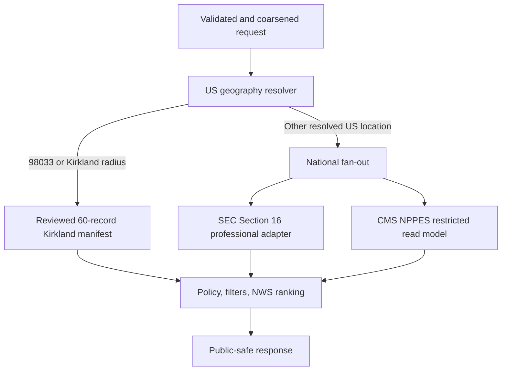

# NWS Nearby Intelligence — end-to-end technical handoff

> This is the short integration handoff. The authoritative national source, infrastructure,
> acceptance, and rollback details are in
> [US national coverage handoff](US_NATIONAL_COVERAGE_HANDOFF.md).

## Service summary

NWS Nearby Intelligence is a standalone FastAPI service on Cloud Run. A Hushh product sends a
consented location through its BFF, and NWS returns ranked public-professional associations.

| Item | Contract |
| --- | --- |
| Source repository | HusshOne monorepo, `services/nws-nearby-intelligence/` |
| GCP project / region | `hushh-tech-prod` / `us-central1` |
| Cloud Run service | `nws-nearby-intelligence` |
| Public base URL | `https://nws-nearby-intelligence-fro3hygenq-uc.a.run.app` |
| Business endpoint | `POST /v2/nearby-network/discover` |
| Public probes | `GET /health`, `GET /ready` |
| Runtime | Python 3.13, FastAPI, Cloud Run, Cloud SQL |
| Auth | Server-held `X-NWS-API-Key` |
| Geography | 33,791-record 2025 Census Gazetteer ZCTA package |
| Candidate mode | Reviewed Kirkland release plus national SEC/NPPES fan-out |
| Completion state | Always `complete: false` |

The service is reusable across projects and uses wildcard non-cookie CORS to avoid origin
allowlisting. That does not authorize putting its key in browser or mobile-client code.

## Product meaning

“Nearby” means a public association to the query area:

- A reviewed civic, institutional, education, or company association in the Kirkland release.
- A public issuer-office association supported by an SEC Officer/Director filing.
- A public practice-area association supported by an active individual NPPES record.

It never means physical presence, device tracking, residence, or a person’s real-time location.
NWS does not return private address/contact data or infer personal financial strength.

## Location behavior

### Preferred coordinate request

```json
{
  "query": {
    "latitude": 41.782504,
    "longitude": -87.602734,
    "country_code": "US"
  },
  "top_n": 60
}
```

The coordinate is rounded to two decimals before lookup/retrieval and is not written to
application logs. Explicit country context is preferred.

If country is omitted, NWS infers approximate US context from the packaged 2025 Census
state/territory polygon. It tests only the privacy-coarsened cell (center, edges, and corners) at
coastlines so rounding does not move an onshore coordinate just offshore. The response discloses
the boundary method; clients should still supply country context when it is available.

### ZIP fallback

```json
{"query":{"postal_code":"60637"},"top_n":60}
```

A bare five-digit ZIP or ZIP+4 is interpreted as US. ZIP+4 is reduced to its five-digit ZCTA base
for search while the original input is preserved in query metadata. `country_code: "US"` is also
accepted.

The index contains every one of the 33,791 ZCTA records in the packaged 2025 Census Gazetteer
release. A ZCTA is statistical geography, not a USPS boundary or residence. A ZIP absent from that
release returns `LOCATION_UNRESOLVED`; NWS never guesses a nearby ZIP.

### Coverage states

| State | Consumer action |
| --- | --- |
| `COVERED` | Render the returned public associations and freshness/source disclosure. Empty is a valid sparse outcome. |
| `LOCATION_UNRESOLVED` | Ask for a consented coordinate or show that the ZIP is unavailable. Never substitute a market. |
| `NOT_COVERED` | Show US-only availability for explicit non-US or unresolved-country coordinates. |

`COVERED` does not promise a population census or 60 results in every ZIP.

## Candidate architecture



### Reviewed Kirkland path

`98033` retains the versioned 60-record reviewed release, candidate citations, source-family
counts, evidence/revalidation flags, release hashes, and 13-organization anchor disclosure. It is
not reused elsewhere.

### SEC path

The SEC adapter accepts only natural-person Officers/Directors and requires the upstream source to
confirm `professional` ordering that excludes disclosed and market value. It keeps public identity,
role, issuer, filing date, coarsened issuer-office association, and SEC provenance.

It rejects owner-only records and likely legal entities. It does not retain securities, shares,
market/disclosed value, liquidity, street/phone, raw coordinates, or exact distance. If the source
does not honor the value-free contract, the adapter fails closed.

### NPPES path

The NPPES adapter calls the fixed `public.nws_public_professionals_by_postal` and
`public.nws_public_professionals_nearby` Cloud SQL functions. They admit active individual
providers and return only professional identity, credential/taxonomy, city/state/ZIP, geospatial
practice association, and `last_seen`. The NWS database role cannot select the underlying
provider/ZIP tables or the owner-inspection view.

Postal requests use an exact five-digit practice ZIP first, then bounded PostGIS radius expansion
when the ZIP is sparse and `auto_expand` is enabled. Coordinate requests use bounded PostGIS
radius search directly. Public output uses practice postal-area semantics and omits raw coordinates,
street/mailing address, phone, and raw records. Unsupported network/financial score inputs remain
zero.

### Exclusions

BrokerCheck is excluded pending written clearance for its unresolved AI/predictive-use terms.
Instagram, LinkedIn, Crunchbase scraping, social check-ins, private pages, data brokers, CAPTCHA
bypass, and personal residence/property data are not national candidate sources.

## “Real-time” and freshness

NWS performs a live request-time query over current source snapshots:

- Kirkland reads an immutable reviewed manifest.
- SEC queries a built national index and reports index/filing freshness.
- NPPES queries the current restricted Cloud SQL snapshot and reports `last_seen`/query freshness.

It does not crawl source sites during a user request, and source freshness never means the person
is physically present. A national source can report healthy, empty, or unavailable. Fail-soft
fan-out may return the other source; it must never fabricate results.

## Consumer integration

Keep the API key in the consumer’s BFF/server secret store:

```text
browser or mobile app -> consumer BFF -> NWS Cloud Run
```

Example server-side call:

```bash
curl --fail-with-body -X POST \
  -H 'Content-Type: application/json' \
  -H "X-NWS-API-Key: $NWS_API_KEY" \
  -d '{"query":{"postal_code":"60637"},"top_n":60}' \
  'https://nws-nearby-intelligence-fro3hygenq-uc.a.run.app/v2/nearby-network/discover'
```

Do not echo the key or put it in a URL. The client must:

1. Collect location consent.
2. Send explicit US context with coordinates when known.
3. Parse `coverage.status` on every `200`.
4. Accept covered-but-sparse results without retrying against Kirkland.
5. Show public-association and snapshot-freshness wording.
6. Honor `429`/`Retry-After`.

The exact fields, errors, filters, and privacy omissions are in [API contract](API_CONTRACT.md).

## Privacy invariants

Do not add or serialize:

- Raw/exact person coordinates, exact person distance, residence, street/mailing address, phone,
  email, personal contacts, or family/household relationships.
- Securities, shares, market/disclosed value, liquidity, property, compensation, income, assets,
  net worth, or ability-to-pay inference.
- Private pages, authentication/CAPTCHA bypass, check-ins, or device-location assertions.

Every response exposes `financial_context: NOT_PROFILED`. Public location labels describe an
issuer office, practice area, institution, civic office, or opt-in association only.

## Production resources

| Purpose | Identifier |
| --- | --- |
| Runtime service account | `nws-nearby-runtime@hushh-tech-prod.iam.gserviceaccount.com` |
| Build service account | `nws-nearby-build@hushh-tech-prod.iam.gserviceaccount.com` |
| Deploy service account | `nws-nearby-deployer@hushh-tech-prod.iam.gserviceaccount.com` |
| Cloud SQL instance | `hushh-tech-prod:us-central1:hushh-directories-db` |
| NPPES database / role | `healthcare` / `nws_nearby_ro` |
| NWS credential secret | `nws-nearby-api-key` |
| SEC credential secret | `insider-api-key` |
| NPPES password secret | `nws-nearby-nppes-db-password` |

These are names, not values. Production references explicit numbered secret versions. Workload
Identity Federation and dedicated service accounts handle delivery; no NWS SSH key or VM login is
needed.

## Development and CI

```bash
cd services/nws-nearby-intelligence
python3.13 -m venv .venv
.venv/bin/python -m pip install -e '.[dev]'
.venv/bin/python -m pytest -q
.venv/bin/python -m ruff check app tests
.venv/bin/python -m compileall -q app tests
```

The path-scoped NWS CI validates Python 3.13 tests, lint, compilation, Docker/runtime dependency
consistency, national geography integrity, source adapters, privacy gates, and legacy regression
tests. The production workflow builds an immutable image after successful main CI, attaches Cloud
SQL, injects numbered secrets, deploys Cloud Run, and verifies `/health` and `/ready`.

## Release proof

Do not collapse these proof layers:

1. Intended source SHA merged to `main`.
2. NWS CI green for that SHA.
3. SEC professional endpoint and NPPES restricted view healthy.
4. Cloud Run latest-ready revision and 100% traffic match the intended image digest.
5. `/health` and `/ready` return expected service/model state.
6. Authenticated business probes pass for `60637`, `98033`, multiple regions, a sparse ZCTA, and an
   explicit non-US coordinate.
7. Response and Cloud Run logs pass privacy/secret redaction review.

For the release snapshots, `60637` with `top_n: 60` is expected to return at least 60 results. That
is a dense-market release-health check, not a universal result-count guarantee.

## Rollback

```bash
gcloud run services update-traffic nws-nearby-intelligence \
  --project=hushh-tech-prod \
  --region=us-central1 \
  --to-revisions=<known-good-revision>=100
```

Repeat health/readiness, auth, `60637`, `98033`, non-US, and privacy checks after rollback. If the
known-good revision is Kirkland-only, immediately communicate that national availability is
rolled back. Never restore availability by weakening auth/privacy/source gates or filling sparse
ZIPs with unrelated candidates.

For the full operator checklist, database grant validation, monitoring signals, incident response,
and source semantics, use [US national coverage handoff](US_NATIONAL_COVERAGE_HANDOFF.md).
