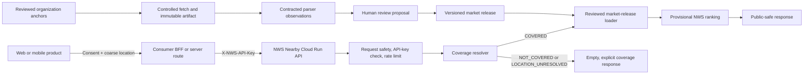

# NWS Nearby Intelligence — End-to-End Technical Handoff

> **Audience:** product engineers, backend engineers, data reviewers, and platform operators.
>
> **Canonical scope:** the standalone NWS API in `services/nws-nearby-intelligence/`. This is a developer handoff, not a promise of national coverage or a live people-scraping system.

## 1. Executive summary

NWS Nearby Intelligence is a standalone FastAPI service on Cloud Run. A consuming Hushh product sends a consented location through its own server-side BFF, and the service returns ranked **reviewed public-association records** only when that location has approved market coverage.

The current production release is deliberately narrow:

| Item | Current state |
| --- | --- |
| Production service | `nws-nearby-intelligence` in `hushh-tech-prod` / `us-central1` |
| Public base URL | `https://nws-nearby-intelligence-fro3hygenq-uc.a.run.app` |
| Business endpoint | `POST /v2/nearby-network/discover` |
| Public probes | `GET /health`, `GET /ready` |
| Runtime | Python 3.13, FastAPI, Cloud Run |
| Service version | `2.5.0` |
| Active data mode | `REVIEWED_PUBLIC_ASSOCIATION_RELEASE` |
| Approved market | Kirkland, Washington / US postal code `98033` |
| Current source release | `us-wa-kirkland-public-association-2026-08-13` |
| Current model | `nws-v2.3.0-kirkland.2026-08-13` |
| Reviewed records | 60 public-association records across 13 reviewed organizations |
| Organization discovery | 13 anchors, review-only, not a complete census |

The service accepts worldwide coordinates and country-qualified postal input safely. That does **not** mean it has worldwide people coverage:

- Covered Kirkland input returns the reviewed release.
- A valid coordinate outside an approved market returns `200` with `coverage.status: "NOT_COVERED"` and `results: []`.
- A valid postal code outside the loaded canonical postal index returns `200` with `coverage.status: "LOCATION_UNRESOLVED"` and `results: []`.

“Nearby” always means a person’s public professional, institutional, civic, or opt-in association. It never means that the person is physically nearby, lives there, or supplied a real-time location.

## 2. Product and safety contract

### What NWS does

- Accepts a consented device coordinate or a manual postal-code fallback.
- Coarsens coordinates before coverage lookup, retrieval, and response serialization.
- Selects only reviewed public organization, campus, civic-office, or opt-in associations.
- Returns public citations, evidence disclosure, confidence, revalidation flags, and a provisional NWS score explanation.
- Supports consumers in multiple projects through a common API contract and server-to-server authentication.

### What NWS does not do

- It is not a real-time people-location, residence, contact, family-graph, or device-tracking service.
- It is not a nationwide or global people directory.
- It does not infer personal net worth, income, liquidity, property value, wealth, or ability to pay.
- It does not use personal social profiles, check-ins, lifestyle signals, private pages, CAPTCHA bypasses, login-required pages, or personal-contact enrichment.
- It does not automatically publish people discovered by a crawler.

These boundaries are enforced in the public response and source policy, not merely described in prose. See [Financial Context Boundary](FINANCIAL_CONTEXT_BOUNDARY.md), [Organization Discovery O1](ORGANIZATION_DISCOVERY_O1.md), and [`config/sources.yaml`](../config/sources.yaml).

## 3. Runtime architecture



There is intentionally no direct arrow from a crawler or parser to the live API. The active production query path loads the finite reviewed release, rather than a live collector, PostGIS database, or national graph.

## 4. Consumer integration

### 4.1 Use a BFF or server route

Every consumer calls NWS from its backend/BFF. Do not place `NWS_API_KEY` in browser JavaScript, a mobile bundle, `NEXT_PUBLIC_*`, source control, logs, or DevTools.

```text
browser or mobile app
        ↓
consumer-owned BFF/server route (holds its secret)
        ↓
NWS Nearby API
```

The public Cloud Run URL and wildcard CORS reduce cross-project origin friction; they do not turn a browser-exposed key into authentication.

### 4.2 Authentication and CORS

| Concern | Contract |
| --- | --- |
| Discovery authentication | `X-NWS-API-Key` is required for `POST /v2/nearby-network/discover`. Missing or invalid credentials return `401`. |
| Health / readiness | `GET /health` and `GET /ready` are public. |
| CORS | Non-cookie requests from arbitrary origins are permitted for `POST` and `OPTIONS`; responses use `Access-Control-Allow-Origin: *` and do not allow credentials. |
| Rate limiting | The deployed baseline is an in-process 60 RPM limiter keyed by key fingerprint plus client IP. It is an abuse guard, not a distributed per-tenant quota. |
| Request size | Bodies over 32 KiB receive `413`. |
| Required next step for external scale | Add gateway/WAF quota controls and independently managed per-consumer credentials before high-volume or external onboarding. |

Example BFF request:

```bash
curl --fail-with-body -X POST \
  -H 'Content-Type: application/json' \
  -H "X-NWS-API-Key: $NWS_API_KEY" \
  -d '{
    "query": {
      "latitude": 47.6715,
      "longitude": -122.2133,
      "country_code": "US"
    },
    "top_n": 100,
    "filters": {"minimum_confidence_grade": "B"}
  }' \
  'https://nws-nearby-intelligence-fro3hygenq-uc.a.run.app/v2/nearby-network/discover'
```

### 4.3 Request contract

Supply exactly one location form. Unknown fields and mixed input are rejected.

| Field | Type / default | Rules |
| --- | --- | --- |
| `query.latitude` | number | Required together with `longitude`; range `-90` to `90`. |
| `query.longitude` | number | Required together with `latitude`; range `-180` to `180`. |
| `query.country_code` | ISO-3166 alpha-2 | Optional client context for coordinates. Required for postal input except legacy `98033`. Lowercase input is normalized. |
| `query.postal_code` | string | 3–16 alphanumeric, space, or hyphen characters; normalized to uppercase. Mutually exclusive with coordinates. |
| `top_n` | integer; default `100` | `1`–`400`. |
| `initial_radius_km` | number; default `20` | Greater than `0`, at most `250`. |
| `max_radius_km` | number; default `100` | Greater than `0`, at most `500`, and not less than `initial_radius_km`. |
| `auto_expand` | boolean; default `true` | Permits expansion within the approved query settings. |
| `diversity` | boolean; default `true` | Applies diversity behavior to the returned covered-market result set. |
| `filters.minimum_confidence_grade` | `A`, `B`, `C`, or `D`; default `B` | Minimum score-confidence threshold. |
| `filters.lanes` / `filters.tags` | arrays | Optional product filters; at most 20 tags. |

#### Consented coordinate request

```json
{
  "query": {
    "latitude": 47.6715,
    "longitude": -122.2133,
    "country_code": "US"
  },
  "top_n": 100,
  "initial_radius_km": 20,
  "max_radius_km": 100,
  "filters": {
    "minimum_confidence_grade": "B"
  }
}
```

The current default rounds this example to `{ "latitude": 47.67, "longitude": -122.21 }` before coverage and retrieval. Raw request coordinates are not logged by application middleware.

#### Manual postal fallback

```json
{
  "query": {
    "postal_code": "98033",
    "country_code": "US"
  },
  "top_n": 100
}
```

The historical request below remains compatible and is interpreted as US:

```json
{
  "query": {
    "postal_code": "98033"
  }
}
```

For all other postal codes, include country context. For example, `{"postal_code":"110001","country_code":"IN"}` is syntactically valid but is not yet in the approved postal geography index.

### 4.4 Coverage handling

Every successful discovery response has a `coverage` object.

| Status | Meaning | UI / integration behavior |
| --- | --- | --- |
| `COVERED` | The request resolves to an approved market release. | Render reviewed public-association results and their provisional/source disclosure. |
| `NOT_COVERED` | The coordinate was understood, but no approved public-association market exists there. It also covers a country-context mismatch. | Render an availability state. Do not retry with Kirkland or show fallback people. |
| `LOCATION_UNRESOLVED` | Postal syntax was valid but its canonical country-qualified postal geography is not loaded. | Ask for an approximate coordinate when appropriate, or show that the area is not yet indexed. |

Current coverage behavior:

- US `98033` is covered.
- The coarse coordinate `47.67, -122.21` is covered by the approved Kirkland market.
- A valid coordinate in India, New York, or any other currently unapproved area returns `NOT_COVERED` and no people.
- A valid non-`98033` postal code, including `110001` / `IN`, returns `LOCATION_UNRESOLVED` and no people until canonical geography is approved.
- A non-US `country_code` supplied with an otherwise Kirkland-covered coordinate returns `NOT_COVERED` with `COUNTRY_CONTEXT_DOES_NOT_MATCH_APPROVED_MARKET`.

### 4.5 Response contract

The complete OpenAPI contract is available at:

```text
https://nws-nearby-intelligence-fro3hygenq-uc.a.run.app/docs
https://nws-nearby-intelligence-fro3hygenq-uc.a.run.app/openapi.json
```

The response always includes the following top-level fields:

```json
{
  "query": {},
  "coverage": {},
  "snapshot": {},
  "release": {},
  "discovery": {},
  "financial_context": {},
  "score_definition": "...",
  "generated_at": "...",
  "summary": {},
  "results": []
}
```

Representative covered response shape, with result data intentionally abbreviated:

```json
{
  "query": {
    "label": "Kirkland, Washington 98033 query area",
    "mode": "POSTAL_CODE",
    "postal_code": "98033",
    "country_code": "US"
  },
  "coverage": {
    "status": "COVERED",
    "reason_code": "APPROVED_MARKET_RELEASE",
    "market_id": "us-wa-kirkland-public-association",
    "complete": false,
    "data_mode": "REVIEWED_PUBLIC_ASSOCIATION_RELEASE"
  },
  "snapshot": {
    "score_status": "PROVISIONAL",
    "complete": false,
    "model_version": "nws-v2.3.0-kirkland.2026-08-13",
    "reviewed_at": "2026-08-13"
  },
  "release": {
    "release_id": "us-wa-kirkland-public-association-2026-08-13",
    "candidate_set_sha256": "<64-character SHA-256>"
  },
  "discovery": {
    "mode": "ORGANIZATION_ANCHOR_REVIEW_PIPELINE_O1",
    "organization_anchor_count": 13,
    "market_census_complete": false,
    "automatic_candidate_publication": false
  },
  "financial_context": {
    "status": "NOT_PROFILED",
    "personal_financial_strength": "NOT_PROVIDED"
  },
  "summary": {
    "reviewed_public_association_candidate_count": 60,
    "returned_count": 60,
    "search_performed": true,
    "candidate_backend": "reviewed-public-association-release"
  },
  "results": [
    {
      "rank": 1,
      "display_name": "<reviewed public-profile name>",
      "organization": "<public organization>",
      "public_location": {
        "granularity": "EXACT_PUBLIC_VENUE",
        "approximate_distance_band": "within 2 km",
        "note": "Distance is to a public professional or institutional association, never a residence."
      },
      "sources": [
        {"publisher": "<publisher>", "url": "https://..."}
      ]
    }
  ]
}
```

Do not assume every covered request returns 60 records. `top_n`, confidence, radius, lane, tag, and diversity settings affect `returned_count`.

Each result may include rank, organization, lane, public-association context, coarse public distance band, NWS score/breakdown, confidence, reasons/warnings, tags, revalidation status, evidence counts, and public citations. It never includes an exact person coordinate or distance, home/residence, personal contact data, family graph, raw source document, or named financial attribute.

### 4.6 Errors and response headers

| Status | Code / condition | Consumer behavior |
| --- | --- | --- |
| `200` | `COVERED`, `NOT_COVERED`, or `LOCATION_UNRESOLVED` | Parse `coverage.status`; non-coverage is a normal product state, not an exception. |
| `401` | `API_KEY_REQUIRED` | Fix BFF/server-side credential injection. Never add a client-side fallback key. |
| `413` | `REQUEST_TOO_LARGE` | Reduce request payload size. |
| `422` | Invalid, partial, mixed, or ambiguous location/query form | Correct the request; do not reinterpret the location client-side. |
| `429` | `RATE_LIMITED` | Respect `Retry-After` and back off. |
| `5xx` | Service failure | Show a retryable service error; preserve the user’s location choice locally only as appropriate. |

Successful responses also expose request/rate-limit headers such as `X-Request-ID`, `X-RateLimit-Limit`, `X-RateLimit-Remaining`, and `X-RateLimit-Reset`.

## 5. Current 98033 source release

### 5.1 Release identity

| Field | Value |
| --- | --- |
| Manifest | [`data/markets/us-wa-kirkland/2026-08-13/release.json`](../data/markets/us-wa-kirkland/2026-08-13/release.json) |
| Release ID | `us-wa-kirkland-public-association-2026-08-13` |
| Market ID | `us-wa-kirkland-public-association` |
| Review / retrieval date | `2026-08-13` |
| Source policy | `public-association-v1` |
| Candidate records | 60 |
| Organizations | 13 |
| Public venues | 11 |
| Evidence sets | 19 |
| Model state | Provisional, `complete: false` |
| Discovery anchor release | [`organization_anchors.json`](../data/markets/us-wa-kirkland/2026-08-13/organization_anchors.json) — 13 anchors, not a census, no automatic publication |

`release.json` is the authoritative candidate-level release artifact. It contains every result’s role, organization, public association, citation URL, fact types, source retrieval date, tags, and review flags. The API returns content hashes for the candidate set, source registry, and entire manifest so a consumer or reviewer can identify the exact release used.

### 5.2 Active public source inventory

The table below is a concise operational index of the 19 reviewed evidence sets. It is not a list of people’s private locations. Each source supports a public role and/or public organization, campus, civic-office, or institutional association.

| Public organization / publisher | Records | Reviewed public source(s) |
| --- | ---: | --- |
| Bluetooth SIG | 1 | [Executive team](https://www.bluetooth.com/about-us/executive-team/); [bylaws](https://www.bluetooth.com/wp-content/uploads/2024/06/Bluetooth-SIG-Bylaws.pdf) |
| City of Kirkland | 9 | [City Manager’s Office](https://www.kirklandwa.gov/Government/City-Managers-Office); [City Council](https://www.kirklandwa.gov/Government/City-Council); [City Hall](https://www.kirklandwa.gov/Government/City-Hall) |
| Compass Construction | 6 | [Leadership](https://www.compass-gc.com/about/leadership/) |
| Echodyne | 1 | [Company](https://www.echodyne.com/company) |
| EvergreenHealth | 1 | [Careers leadership](https://careers.evergreenhealth.com/) |
| GenCap Construction | 8 | [People](https://gencapgc.com/people/) |
| INRIX | 1 | [AI traffic products release](https://inrix.com/press-releases/inrix-announces-new-generation-of-ai-traffic-products/); [Kirkland-dated release](https://inrix.com/press-releases/inrix-integrates-clevercitis-ai-powered-parking-detection-to-expand-real-time-curb-intelligence/) |
| Kirkland Chamber of Commerce | 9 | [Board of Directors](https://www.kirklandchamber.org/the-board-of-directors); [contact](https://www.kirklandchamber.org/contact) |
| Lake Washington Institute of Technology | 10 | [Executive staff](https://www.lwtech.edu/about-us/executive-staff/index.aspx) |
| Monolithic Power Systems | 1 | [Management](https://www.monolithicpower.com/en/about-mps/investor-relations/corporate-governance/management.html); [City public permit association](https://permits.kirklandwa.gov/WebDocs/2020121635/0438365d-98af-469c-b510-2f29dc9b14cd.pdf) |
| Northwest University | 11 | [President’s Cabinet](https://www.northwestu.edu/president/cabinet); public [directories](https://eagle.northwestu.edu/directory/); [contact](https://www.northwestu.edu/about/contact) |
| Wyze | 1 | [Our story](https://www.wyze.com/pages/our-story); [contact](https://www.wyze.com/pages/contact-us) |
| Ziply Fiber | 1 | [About Ziply Fiber](https://ziplyfiber.com/about-us) |
| **Total** | **60** | **19 evidence sets from 13 reviewed organizations** |

Candidate-level citations and fact types in the manifest are the source of truth. A publisher/URL must not be treated as independent corroboration merely because it appears more than once; URLs on the same source-domain family count as one family and retain a revalidation signal.

### 5.3 Source semantics

Each publishable candidate needs reviewed support for all of these facts:

1. Identity.
2. Current role.
3. Organization identity.
4. Public association.

The public association is limited to a public organization office, campus, civic office, institutional venue, city-level association, or opt-in location. A public office is not a statement of a person’s residence or physical presence. A current release flag such as `ROLE_REFRESH_REQUIRED` is rendered to clients and must be addressed in the next review cycle rather than silently overwritten.

## 6. Source contracts, collectors, and review boundary

### 6.1 Important distinction: declared contracts vs. active ingestion

[`config/sources.yaml`](../config/sources.yaml) declares 23 source contracts. These contracts define allowed facts, prohibited facts, source provenance, and candidate-proposal policy. They are **not** a claim that 23 production scrapers, workers, databases, or national datasets are running today.

The repository currently provides controlled fetch/parser foundations and the O1 review boundary. It does not yet operate scheduled national collectors, a production PostGIS retrieval plane, a public review UI, a completed market census, or an automatic candidate-publication path.

### 6.2 Source-contract inventory

| Class | Contract IDs | Allowed role in the system |
| --- | --- | --- |
| Geography | `census_gazetteer_zcta`, `census_tiger_places` | Canonical ZIP/ZCTA and place geography after approved ingestion; no person inference. |
| SEC / official filing relationships | `sec_edgar_ownership`, `sec_iapd_adv`, `sec_proxy_and_company_filings` | Public role, issuer, firm, board, or relationship review only. Do not use disclosed ownership, AUM, or compensation as personal wealth. |
| Institutional / research facts | `irs_990_xml`, `uspto_patentsview_bulk`, `openalex_snapshot` | Reviewable nonprofit, invention, research, and institutional facts; no named financial profile. |
| Official public pages | `official_company_pages`, `official_fund_and_portfolio_pages`, `official_government_directories`, `university_and_research_bios`, `official_press_releases` | May create review-required proposals only after scoped fetch, artifact, parser, and policy gates. |
| Discovery only | `sec_form_d`, `wikidata_dump`, `common_crawl`, `local_business_directory_discovery`, `state_business_registries`, `public_event_agendas`, `github_public_claimed_profiles`, `usaspending_awards`, `sbir_awards` | Find organizations or official sources. Never directly create a candidate, score input, or public API result. |
| Disabled social | `public_social_verified` | Disabled and discovery-only. It cannot support wealth, residence, lifestyle, check-in, face-recognition, or direct candidate publication. |

All contracts inherit these non-negotiable controls:

- Immutable artifacts with SHA-256 and parser-version provenance.
- No authentication bypass, CAPTCHA bypass, private pages, or personal-contact enrichment.
- No direct writer from a collector/parser to NWS scores or the public API.
- No private residence or family-relationship claim.

### 6.3 Organization Discovery O1

O1 is the safe expansion intake path:

```mermaid
flowchart LR
  A[Reviewer-approved organization anchor] --> B[HTTPS fetch scoped to approved host and paths]
  B --> C[Robots-aware, size and content-type checks]
  C --> D[Immutable SHA-256 artifact]
  D --> E[Contracted parser observation]
  E --> F[REVIEW_REQUIRED organization-role proposal]
  F --> G[Human identity, role, location, and suppression review]
  G --> H[Manually versioned release.json change]
  H --> I[Tests and CI]
  I --> J[New NWS API release]
```



The current anchor manifest contains 13 person-free organization records. Every anchor supplies a canonical organization/domain, approved hosts and path prefixes, a source contract ID, a public market label, and a public location classification. It deliberately sets:

```json
{
  "market_census_complete": false,
  "automatic_candidate_publication": false
}
```

An O1 proposal is never `release_eligible` without a separate human-reviewed market-release change.

### 6.4 Reviewer gate before adding a person

Before a person enters a future `release.json`, the reviewer must confirm:

1. Identity resolution beyond a name-only match.
2. A current public role and explicit organization relationship.
3. A public association, not a residence, mailing address, registered agent, or a one-time event.
4. Source URL/domain family, immutable artifact SHA-256, parser version, source contract ID, and retrieval date.
5. Required identity/current-role/organization/public-association fact coverage.
6. Revalidation flags for one-domain evidence; multiple URLs from one domain do not create independent corroboration.
7. Suppression, correction, and policy checks.
8. A manually reviewed manifest update with test coverage before deployment.

## 7. Scoring, explainability, and financial boundary

### 7.1 NWS score

NWS means **Network Worth Score** in the existing product terminology: a provisional estimate of public professional-network strength and opportunity access. It is not financial net worth or a personal financial score.

The current provisional role-taxonomy model exposes its components and weights:

| Component | Weight |
| --- | ---: |
| `graph_authority` | 30% |
| `institutional_influence` | 20% |
| `verified_track_record` | 20% |
| `capital_access` | 10% |
| `evidence_confidence` | 8% |
| `trusted_reach` | 7% |
| `freshness` | 5% |

The response publishes weighted components, evidence count, coverage multiplier, integrity penalty, local relevance, reasons, and warnings. The release remains `PROVISIONAL` because it uses conservative public-role taxonomy priors; a completed regional graph and production PostGIS index are not populated.

`capital_access` is strictly a public professional-relationship signal, such as a verified organization role. It is not a proxy for net worth, income, ownership value, liquidity, or ability to pay.

### 7.2 Financial and personal-data boundary

Every response has this intentional boundary:

```json
{
  "financial_context": {
    "status": "NOT_PROFILED",
    "personal_financial_strength": "NOT_PROVIDED",
    "personal_assets_or_liquidity": "NOT_PROVIDED",
    "property_value_or_residence": "NOT_PROVIDED",
    "aggregate_local_economic_context": "NOT_AVAILABLE"
  }
}
```

Never add these inputs or outputs to `/v2/nearby-network/discover`:

- Named financial-strength/wealth/liquidity/asset values or rankings.
- Personal property, assessor, sale, trust, LLC, residence, or mailing-record linkage.
- Compensation, Form D offering amount, adviser AUM, nonprofit assets, grant value, or public-company ownership converted into personal wealth.
- Social/lifestyle/home/vehicle/follower/check-in inference.

A future aggregate local-economic-context product, if approved, must be a separately governed geography-only service with suppression thresholds. It must not join an area’s data to NWS candidates or influence people ranking.

## 8. Development and release operations

### 8.1 Key code and data locations

| Purpose | Location |
| --- | --- |
| FastAPI surface and response serialization | [`app/main.py`](../app/main.py) |
| Coverage behavior | [`app/coverage.py`](../app/coverage.py) |
| API-key and rate limiter | [`app/security.py`](../app/security.py) |
| Release loader and evidence validation | [`app/market_release.py`](../app/market_release.py) |
| Organization discovery review boundary | [`app/organization_discovery.py`](../app/organization_discovery.py) |
| NWS model and weights | [`app/nws.py`](../app/nws.py) |
| Source contract registry | [`config/sources.yaml`](../config/sources.yaml) |
| Current source release | [`data/markets/us-wa-kirkland/2026-08-13/release.json`](../data/markets/us-wa-kirkland/2026-08-13/release.json) |
| Organization anchors | [`data/markets/us-wa-kirkland/2026-08-13/organization_anchors.json`](../data/markets/us-wa-kirkland/2026-08-13/organization_anchors.json) |
| Tests | [`tests/`](../tests/) |

### 8.2 Local development

Use Python 3.13.

```bash
cd services/nws-nearby-intelligence
python3.13 -m venv .venv
.venv/bin/python -m pip install -e '.[dev]'
.venv/bin/python -m pytest -q
.venv/bin/python -m uvicorn app.main:app --host 0.0.0.0 --port 8080
```

For local-only development, copy `.env.example` to `.env`. Its values are placeholders. Never put a production key in a local file, test fixture, screenshot, command history, or commit.

Basic local checks:

```bash
cd services/nws-nearby-intelligence
python -m pytest -q
python -m ruff check app tests
python -m compileall -q app tests
```

### 8.3 CI and production delivery

The NWS delivery lane is intentionally separate from HusshOne’s `one` application.

| Stage | Workflow | What it does |
| --- | --- | --- |
| CI | [`.github/workflows/nws-nearby-ci.yml`](../../../.github/workflows/nws-nearby-ci.yml) | Runs on NWS-service or NWS-workflow changes; installs hash-pinned dependencies on Python 3.13; runs pytest, focused Ruff, and compilation. |
| Production deploy | [`.github/workflows/deploy-nws-nearby-production.yml`](../../../.github/workflows/deploy-nws-nearby-production.yml) | Runs only after successful same-repository `main` push CI or a main-only manual dispatch; authenticates by OIDC, builds an immutable image, deploys the standalone service, then probes `/health` and `/ready`. |

The normal change path is:

```text
branch → pull request → NWS CI → review → main merge
      → main NWS CI → protected production deploy → public health/readiness probes
```

The deployment uses dedicated least-privilege runtime, builder, and deploy identities. It does not use an SSH key or VM. Exact identity, Secret Manager, workload-federation, bucket, and break-glass resource identifiers remain in the private platform runbook rather than this public repository.

### 8.4 Environment and secret management

| Setting | Production behavior |
| --- | --- |
| `NWS_ENVIRONMENT` | `production` |
| `NWS_REQUIRE_API_KEY` | `true` |
| `NWS_DATA_MODE` | `REVIEWED_PUBLIC_ASSOCIATION_RELEASE` only |
| `NWS_QUERY_LOCATION_DECIMALS` | `2` |
| `NWS_RATE_LIMIT_PER_MINUTE` | `60` per current instance limiter |
| `NWS_MAX_REQUEST_BYTES` | `32768` |
| `NWS_API_KEY` | Read at runtime from a version-pinned secret; never from source control or a client application |

To rotate a key, a platform maintainer creates a new secret version, updates the deployment’s numbered secret reference, deploys a new revision, verifies consumer BFF cutover, and only then retires the old version. Do not use a floating `latest` secret reference for an environment variable.

### 8.5 Deploy verification checklist

Run the following after every code or release-manifest deployment. Use explicit project/region arguments; do not rely on a developer machine’s default GCP project.

```bash
gcloud run services describe nws-nearby-intelligence \
  --project=hushh-tech-prod \
  --region=us-central1 \
  --format='yaml(status.url,status.latestReadyRevisionName,status.traffic)'

curl --fail-with-body \
  'https://nws-nearby-intelligence-fro3hygenq-uc.a.run.app/health'

curl --fail-with-body \
  'https://nws-nearby-intelligence-fro3hygenq-uc.a.run.app/ready'
```

Verify all of the following:

1. The intended source SHA is on `main`, NWS CI is green, and the production workflow is successful.
2. The expected Cloud Run revision has 100% traffic.
3. `/health` and `/ready` return `200` with the expected service/model/release readiness data.
4. A missing discovery key returns `401`.
5. A valid server-side request for `98033` and the corrected Kirkland coordinate returns `COVERED` and the reviewed release.
6. A valid India coordinate returns `200`, `NOT_COVERED`, and `results: []`.
7. `{"postal_code":"110001","country_code":"IN"}` returns `200`, `LOCATION_UNRESOLVED`, and `results: []` until canonical geography is added.
8. Arbitrary-origin `OPTIONS` is CORS-successful, with wildcard origin and no credential header.
9. `/internal/*` and legacy `/v1/*` discovery surfaces return `404`.
10. Logs contain route/status/latency only, never raw location request bodies or API keys.

### 8.6 Rollback

Platform operators can shift all traffic to a known-good revision without rebuilding source:

```bash
gcloud run services update-traffic nws-nearby-intelligence \
  --project=hushh-tech-prod \
  --region=us-central1 \
  --to-revisions=<known-good-revision>=100
```

After rollback, repeat the health, readiness, missing-key, covered-query, and uncovered-query checks above. Do not roll back by weakening API-key requirements, CORS policy, privacy logging, or source-review gates.

## 9. Ownership and change checklists

### Consumer product team

- Obtain access through the platform owner and store the credential only in the consumer BFF/server secret store.
- Collect and explain user location consent in the consumer product.
- Send coordinate input when consented; use country-qualified postal entry as the fallback.
- Branch UI behavior on `coverage.status`; show an honest availability state for non-covered areas.
- Render associations as public professional/institutional/civic context, not as real-time nearby people.
- Preserve result provenance, `score_status`, confidence, and revalidation information where surfaced.

### Data review team

- Start with approved organization anchors and contract-compliant public pages.
- Preserve source URL, fact types, retrieval time, artifact hash, parser version, and review decision.
- Verify identity, current role, organization, and public association before release.
- Add corrections/suppressions before packaging a market release.
- Do not publish a candidate directly from discovery, a directory, a social source, an event, or a name-only match.

### Platform team

- Own Cloud Run service identity, secret rotation, IAM, OIDC, artifact storage, alerts, and traffic rollback.
- Keep the discovery route authenticated and reject client-embedded key patterns during review.
- Verify the service uses a numbered secret version per revision.
- Add gateway/WAF quotas and per-consumer credentials before broad external use.
- Treat production revision/traffic, health/readiness, API auth, CORS, and log-redaction checks as separate proof points.

## 10. Coverage expansion gate and known limitations

### Current limitations

- Only Kirkland / US `98033` has an approved people dataset today.
- The current 13 organization anchors are not a complete market census.
- The 60 records are a finite reviewed release, not a live people search.
- National postal/geography ingestion, scheduled source-specific workers, production PostGIS retrieval, caches, a review UI, and a completed regional graph are not deployed.
- The in-process limiter is not a distributed tenant quota.
- Financial context is intentionally unavailable for named people.

### Required gate for a new market

A country, postal area, or coordinate market may become `COVERED` only when all of these are present:

1. Versioned, canonical country-qualified geography with provenance.
2. Reviewed public institution, organization, civic, or opt-in associations for the market.
3. Privacy, suppression, correction, and policy approval.
4. A versioned candidate/scoring release in the production retrieval path.
5. Negative-coverage tests proving no Kirkland fallback can leak into the new market.
6. A reviewed integration and deployment verification record.

Until then, valid global inputs must continue to return truthful empty coverage states rather than guessed geography or unrelated candidates.

## 11. Related technical documents

| Document | Use it for |
| --- | --- |
| [Service README](../README.md) | Quick integration and local-development overview. |
| [API contract](API_CONTRACT.md) | Full request, coverage, response, and privacy contract. |
| [Production handoff](PRODUCTION_HANDOFF.md) | Integration, auth/CORS, release, and rollback procedures. |
| [Kirkland 98033 source release](KIRKLAND_98033_SOURCE_RELEASE.md) | Source/review semantics and release-refresh rules. |
| [Organization Discovery O1](ORGANIZATION_DISCOVERY_O1.md) | Anchor, artifact, parser, and human-review boundary. |
| [Financial Context Boundary](FINANCIAL_CONTEXT_BOUNDARY.md) | Explicit no-personal-finance boundary. |
| [Implementation status](IMPLEMENTATION_STATUS.md) | What is actually live versus planned. |
| [Source catalog](SCRAPER_CATALOG.md) | Future source-specific collector design and controls. |
| [Operations runbook](RUNBOOK.md) | Future ingestion/data-plane and incident guidance. |
| [Architecture](../ARCHITECTURE.md) | Broader system design and roadmap. |

## 12. Handoff acceptance checklist

A new developer should be able to answer “yes” to every item below before owning a NWS change:

- [ ] I know that only `POST /v2/nearby-network/discover` is the business endpoint and it requires a server-held key.
- [ ] I know how to distinguish `COVERED`, `NOT_COVERED`, and `LOCATION_UNRESOLVED` in a client.
- [ ] I will not present results as people physically around the user.
- [ ] I will not add private location, contact, social, or financial inference to NWS.
- [ ] I understand that current coverage is Kirkland/`98033` only and the 60-record release is provisional.
- [ ] I will use reviewed public sources and the O1 human-release gate for data expansion.
- [ ] I will run tests and validate the exact release, API auth, coverage behavior, CORS, and logs after deployment.
- [ ] I will use the private platform runbook for secrets, IAM, OIDC, and break-glass operations rather than placing those details in code or shared documentation.
