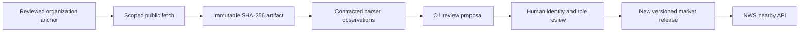

# Organization Discovery O1

## What is deployed by this increment

O1 is an organization-first **intake and review boundary**. It does not turn the
NWS API into a live people crawler and it cannot automatically add anyone to a
nearby result.

The Kirkland bootstrap now has a versioned, person-free anchor release at
`data/markets/us-wa-kirkland/2026-08-13/organization_anchors.json`. It contains
13 reviewed public organizations represented in the existing 60-record market
release. It is deliberately marked:

```json
{
  "market_census_complete": false,
  "automatic_candidate_publication": false
}
```

The existing 60 reviewed records and NWS model are unchanged. The API adds
`discovery` metadata so a client can see that the market is a partial,
reviewed-anchor release rather than a completed organization census.



There is intentionally no arrow from parsing to the public API.

## Anchor contract

An anchor has no person, home, or personal contact data. It contains only:

- Canonical organization identifier and public name.
- Source contract identifier.
- Canonical organization domain and exact approved public path prefixes.
- Public organization-location classification.
- Public market label.

Allowed stable location classifications are:

- `VERIFIED_HEADQUARTERS`
- `VERIFIED_OPERATING_SITE`
- `PUBLIC_BRANCH_OR_CAMPUS`
- `GOVERNMENT_OR_INSTITUTIONAL_OFFICE`

`REGISTERED_OFFICE`, `REGISTERED_AGENT`, `MAILING_ADDRESS`, and `HISTORICAL_SITE`
are represented in the model but cannot create a stable local proposal.

## Intake rules enforced in code

`app/organization_discovery.py` enforces these conditions before it emits a
proposal:

1. The anchor, source contract, artifact source ID, requested URL, and final
   redirect URL all match.
2. The URL is HTTPS, on an explicitly approved organization host, and starts
   with an approved path prefix.
3. The source contract permits review proposals. Discovery-only sources cannot
   create person-role proposals.
4. The parser observation is permitted by the source contract.
5. The role has a same-artifact public identity alias, explicit title, and an
   organization name that matches the anchor.
6. Address, contact, postal, and coordinate-shaped attributes are rejected.
7. Every accepted item is `REVIEW_REQUIRED`, with
   `release_eligible == false`.

`app/collectors/fetcher.py` provides `FetchScope` for organization workers. It
blocks out-of-scope requested URLs and redirects, unapproved content types, and
oversized artifacts before a parser sees the content. The O1 code does not
enable a scheduled crawler; a future worker must use this scope.

## Source policy

The registry now preserves the source's candidate-proposal mode, source family,
and review metadata instead of dropping it during YAML loading.

| Source class | O1 use | May create a role proposal? |
| --- | --- | --- |
| Official company, government, university, and organization press pages | Current public role and public organization association | Yes, after every intake gate; human review still required. |
| SEC Form D, Common Crawl, Wikidata, public directories, state registries, public events, USASpending, SBIR | Find organizations or official source pages | No. Discovery only. |
| SEC IAPD/ADV | Verify firm and licensed-role facts | Review-required only; never AUM or personal-capacity data. |
| Public social | Disabled by default | No. |

No source contract can opt a crawler into direct public API publication.

## Association semantics shown to clients

Each current result has `public_association_context`:

- `BASED_HERE`: a current verified public organization or civic association in
  the market.
- `CONNECTED_HERE`: a reviewed public professional or institutional connection
  in the market.
- `APPEARING_NEARBY`: a time-bounded public event association. The current NWS
  policy excludes it from stable results.
- `OPTED_IN_LOCATION`: a user-controlled, revocable association.

None of these means the person is physically nearby or lives at the association.

## Reviewer handoff

Before a proposal can become a future `release.json` candidate, a reviewer must
confirm all of the following in a source-backed release packet:

1. Identity resolution beyond a name-only match.
2. Current public role and explicit organization relationship.
3. Public organization/campus/civic association, not a residence, mailing
   address, registered agent, or one-time event.
4. Immutable artifact SHA-256, source URL/domain family, parser version,
   retrieval time, and source contract ID.
5. Fact-type coverage for identity, current role, organization identity, and
   public association; one-domain evidence must receive a revalidation flag.
6. Suppression and correction checks.
7. A manually reviewed, versioned market-release change with tests.

Use the normal release process only after those checks. The O1 module itself is
not a release compiler and is intentionally unable to publish a candidate.
