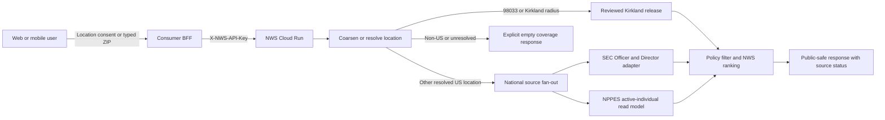

# US national coverage handoff

> **Legacy professional route:** this document covers the national candidate layer behind
> `/v2/nearby-network/discover`. It does not establish named financial coverage and its historical
> score is not Net Worth Score. For `/v3/nearby-net-worth/discover`, use
> [Net Worth Score technical handoff](NET_WORTH_SCORE_HANDOFF.md).
>
> **Audience:** consumer-product engineers, backend engineers, data operators, security reviewers,
> and Cloud Run operators.
>
> **Canonical source:** `services/nws-nearby-intelligence/` in the HusshOne repository.
>
> **Scope:** US location resolution and public-professional discovery. This is not a population
> census, a residence directory, or a physical-presence service.

## 1. Release contract

The national NWS release accepts a consented device coordinate or a US ZIP and selects one of two
people backends:

1. The reviewed Kirkland market release remains the higher-review path for `98033` and coordinates
   within the configured Kirkland market radius.
2. Other resolved US locations query the national public-professional fan-out, currently SEC
   Section 16 Officer/Director associations and active individual CMS NPPES practice associations.

The location and people layers are intentionally separate:

| Layer | What is nationwide | What is not promised |
| --- | --- | --- |
| Geography | The immutable 2025 Census Gazetteer package contains all 33,791 ZCTA records in that release. | ZCTAs are statistical approximations, not USPS delivery boundaries, rooftop geocodes, or evidence that every possible ZIP is present. |
| SEC people source | Live API query over the current nationwide Section 16 index, restricted to natural-person Officers and Directors with a public issuer-office association. | Every professional, every employer, physical presence, or request-time SEC crawling. |
| NPPES people source | Live Cloud SQL query over active individual NPPES records with a public practice association. | Every person, every occupation, a home address, or proof that the provider is physically present now. |
| Kirkland release | 60 manually reviewed public-association records for the reviewed market. | A market census or a template to copy into another location. |

Therefore `coverage.status: "COVERED"` means: the request resolved to the US query geography and
the approved source fan-out ran. It does **not** mean every person in the area is represented, that
the result count is complete, or that a fixed minimum will exist in every ZIP.

## 2. User story and request routing



The consumer application owns consent and calls through a backend-for-frontend (BFF). The BFF
holds the NWS credential. A browser or mobile application must never embed the credential.

“Nearby” means that a public professional association is relevant to the query area. It never
means the named person shared a device location, is physically near the user, or lives there.

## 3. Location contract

### 3.1 US ZIP and ZIP+4

The service accepts a five-digit US ZIP with or without `country_code: "US"`. A syntactically valid
bare five-digit ZIP or ZIP+4 is treated as US. ZIP+4 is deliberately normalized to its five-digit
base because the Census geography is keyed by ZCTA.

```json
{"query":{"postal_code":"60637"},"top_n":60}
```

```json
{"query":{"postal_code":"60637-1234","country_code":"US"},"top_n":60}
```

Both requests search the `60637` ZCTA. The response preserves the original ZIP+4 as
`query.input_postal_code`, while `query.postal_code` contains the normalized five-digit value.

The packaged geography is:

| Field | Value |
| --- | --- |
| Publisher | U.S. Census Bureau |
| Dataset | 2025 Census Gazetteer ZIP Code Tabulation Areas |
| Records | 33,791 |
| Precision | `CENSUS_ZCTA_INTERNAL_POINT` |
| Manifest | `data/geography/us/2025/manifest.json` |
| Reduced data | `data/geography/us/2025/zcta-centroids.tsv` |
| Coordinate boundary | 2025 Census state/territory boundary, 1:500,000 |
| Boundary file | `data/geography/us/2025/state-boundaries-500k.shp` |
| Integrity | ZCTA record count plus geography and boundary SHA-256 values are checked when loaded. |

If a valid-looking ZIP is absent from the packaged ZCTA release, the service returns `200` with
`coverage.status: "LOCATION_UNRESOLVED"` and no people. It does not choose the nearest ZIP.

### 3.2 Coordinates

The preferred national coordinate request supplies explicit US context:

```json
{
  "query": {
    "latitude": 41.782504,
    "longitude": -87.602734,
    "country_code": "US"
  },
  "top_n": 60
}
```

The API rounds the coordinate to the configured two decimal places before coverage lookup and
source retrieval. Application middleware does not log the request body or raw coordinate.

When `country_code` is omitted, the service infers approximate US context from the packaged 2025
Census 1:500,000 state/territory boundary. It checks the privacy-coarsened point and, at a
coastline, the represented cell's center, edges, and corners. The response declares either
`CENSUS_STATE_TERRITORY_BOUNDARY` or
`CENSUS_STATE_TERRITORY_BOUNDARY_QUANTIZED_CELL_INTERSECTION`, the source vintage, and
`approximate: true`. Production clients should send explicit country context when available.

An explicit non-US country always wins over proximity and returns `NOT_COVERED`. If no country is
supplied and bounded inference fails, the service returns `NOT_COVERED` with
`COUNTRY_CONTEXT_UNRESOLVED`.

### 3.3 Coverage statuses

| Status | Meaning | Result behavior |
| --- | --- | --- |
| `COVERED` | The location resolved to the reviewed Kirkland backend or US national source fan-out. | Search runs; results may be populated or empty. `complete` remains `false`. |
| `LOCATION_UNRESOLVED` | Postal syntax was accepted but no canonical geography was selected. | `results: []`; no fallback location. |
| `NOT_COVERED` | The coordinate is explicitly non-US or US context could not be established. | `results: []`; no US or Kirkland fallback people. |

## 4. People sources

### 4.1 Reviewed Kirkland public-association release

`98033` and coordinates within the configured Kirkland market radius use the versioned 60-record
release at `data/markets/us-wa-kirkland/2026-08-13/release.json`. Candidate-level citations,
retrieval dates, source-family counts, manifest hashes, review flags, and the 13-organization
anchor inventory are preserved. See [Kirkland 98033 source release](KIRKLAND_98033_SOURCE_RELEASE.md).

This special path is retained because its civic, institutional, education, and company
associations received manual market review. It is not injected into Chicago or any other location.

### 4.2 SEC Section 16 professional associations

The NWS SEC adapter calls the existing server-side insider source using the source's explicit
`ranking=professional` mode. The source must confirm that ordering is based on Officer/Director
role authority, filing recency, and issuer-office distance and that disclosed/market value is
excluded. It must also declare `relationshipScope: "selected_position"`; the Officer/Director
role is read from the same filing position whose issuer office supplies the location association.
The adapter fails closed if either contract is missing.

Only these facts cross the NWS boundary:

- Natural-person reporting-owner identity and CIK.
- Current Officer and/or Director role and public title.
- Issuer identity and CIK.
- Filing-as-of date.
- Coarsened issuer public-office association at city or postal-area granularity.
- Public SEC profile/dataset provenance and source-index status.

Ten-percent-owner-only records and likely legal entities are rejected. Securities, shares,
disclosed value, market value, liquidity, street address, phone, source response coordinates, and
exact distance are not retained in candidate metadata or returned by NWS. Financial values do not
select or rank the professional result set.

This source proves a public filing relationship to an issuer office. It does not prove residence
or current physical presence.

### 4.3 CMS NPPES active individual practice associations

NWS calls two fixed, least-privilege Cloud SQL functions,
`public.nws_public_professionals_by_postal` and
`public.nws_public_professionals_nearby`, over the shared `healthcare` database. They admit only
active individual providers and project a bounded public-professional column set. The runtime role
can execute those functions but cannot select the underlying `public.providers`, `public.zips`, or
owner-inspection view. The nearby function walks nearest provider-bearing in-radius postal areas
through the ZIP GIST index, uses the provider ZIP index, and stops when the bounded candidate target
is full; this avoids arbitrary service queries, sparse-area false empties, and multi-million-row
spatial scans.

The application projection retains:

- NPI and public professional name.
- Credential and primary taxonomy.
- City, state, and five-digit public practice postal area.
- A source practice point used internally for distance ranking but never serialized as a person
  location; public output is labeled only at postal-area granularity.
- Registry `last_seen` freshness and a public NPPES profile citation.

Street address, mailing address, telephone, raw NPPES payload, and other source columns are not in
the fixed-function result projections used by the adapter or the public response. NPPES rows are
labeled `PROVISIONAL`: the service computes the published NWS shape from supported professional-role,
source-authority, recency, and location-confidence facts, while unsupported graph, track-record,
reach, and financial features stay zero rather than being inferred.

For a postal request, the NPPES path first uses an exact five-digit practice-ZIP query. If that
exact ZIP contains fewer than `top_n` accepted candidates and `auto_expand` is enabled, it runs
bounded PostGIS `ST_DWithin` searches through the configured radius progression and deduplicates by
NPI, retaining exact-ZIP candidates first. Coordinate requests use the bounded PostGIS path
directly. Each retrieval stage and radius appears in `source_status`; a source error is fail-soft so
another national source may still return results.

### 4.4 Source explicitly excluded

FINRA BrokerCheck is **not** in the national NWS fan-out. Repository research identified an
unresolved terms-of-use restriction for AI/predictive use. It remains excluded unless Legal gives
written source-use clearance and the engineering/privacy gates are separately completed. VM or
scraper availability does not override source-use terms.

Social check-ins, Instagram, LinkedIn, Crunchbase scraping, private pages, personal data brokers,
residence/property records, and CAPTCHA/login bypasses are not active NWS people sources.

## 5. Freshness and “real-time” semantics

The business endpoint executes a live query at request time over already-built public-data
snapshots. It does not crawl SEC, CMS, or the open web during the request.

| Source | Request-time behavior | Freshness evidence |
| --- | --- | --- |
| Kirkland reviewed release | Read immutable local manifest. | `release.source_retrieved_at`, `reviewed_at`, candidate citations, and hashes. |
| SEC Section 16 | Call the national professional endpoint and briefly cache a policy-safe batch. | Upstream `index.builtAt`, `index.partial`, filing-as-of dates, stale/revalidation flags, and query timestamp. |
| CMS NPPES | Query the restricted Cloud SQL read model. | Per-row `last_seen`, computed `source_as_of`, `queried_at`, query mode, and truncation status. |

The safe product phrasing is **“live query over current public-source snapshots.”** Do not call the
results live locations or imply that a person moved into/out of the area in real time.

Every national response remains `complete: false`. A source can be `OK`, `EMPTY`, or
`UNAVAILABLE`; a covered ZIP with zero accepted candidates is a truthful sparse result, not
permission to synthesize or copy people from another area. If both configured national sources
are unavailable, discovery returns `503 NATIONAL_CANDIDATE_BACKEND_UNAVAILABLE`. An `EMPTY`
source is available but sparse and does not cause a `503`.

National responses expose top-level `source_status`. NPPES reports source/query mode, candidate and
row counts, rejected rows, source/query timestamps, truncation, granularity, and a bounded error
code when unavailable. SEC reports professional ranking mode, index built/partial/stale state,
raw/accepted/rejected candidate counts, upstream total/truncation state, cache state, and its
association notice. These operational fields must not contain a source token, database URL, or raw
record.

## 6. API and consumer integration

### Endpoint

```text
POST /v2/nearby-network/discover
X-NWS-API-Key: <server-held credential>
Content-Type: application/json
```

`GET /health` and `GET /ready` are public. `/docs` and `/openapi.json` publish the schema. Legacy
`/v1/*` and `/internal/*` discovery routes are not public product surfaces.

Wildcard, non-cookie CORS allows multiple Hushh projects to call their own BFF without an origin
allowlist. It does not make a secret safe in browser or mobile code. Store the key in each
consumer's server-side secret store and proxy the request.

Consumer rules:

1. Collect location consent in the consumer product.
2. Send coordinates with `country_code: "US"` when known; otherwise send a typed ZIP.
3. Branch on `coverage.status`, not HTTP status alone.
4. Treat `results: []` as a valid covered-but-sparse outcome when coverage is `COVERED`.
5. Render public association and source freshness. Never label results “people physically around
   you.”
6. Respect `429` and `Retry-After`; do not retry a coverage miss with a different location.

See [API contract](API_CONTRACT.md) for the exact request, response, filtering, and error schema.

## 7. Production infrastructure

| Resource | Production contract |
| --- | --- |
| GCP project / region | `hushh-tech-prod` / `us-central1` |
| Cloud Run service | `nws-nearby-intelligence` |
| Public URL | `https://nws-nearby-intelligence-fro3hygenq-uc.a.run.app` |
| Runtime identity | `nws-nearby-runtime@hushh-tech-prod.iam.gserviceaccount.com` |
| Build identity | `nws-nearby-build@hushh-tech-prod.iam.gserviceaccount.com` |
| Deploy identity | `nws-nearby-deployer@hushh-tech-prod.iam.gserviceaccount.com` |
| Cloud SQL connection | `hushh-tech-prod:us-central1:hushh-directories-db` |
| NPPES database / role | `healthcare` / `nws_nearby_ro` |
| Main API secret | `nws-nearby-api-key` |
| SEC source secret | `insider-api-key` |
| NPPES database secret | `nws-nearby-nppes-db-password` |

These are secret resource names only; values do not belong in documentation, source, command
output, screenshots, browser storage, or chat. Production deploys use explicit numbered secret
versions, not `latest`.

Cloud Run is configured with the Cloud SQL connection and 30-second request timeout. NPPES uses a
4-second statement timeout, a 2-second connection timeout, and at most two bounded radius-expansion
queries within one 12-second retrieval budget. SEC source calls are bounded by the adapter timeout
and response-size limit. The two source calls run concurrently. NPPES receives up to five times
`top_n` candidates (minimum 200, maximum 2,000); SEC receives at most 100. The national fan-out
deduplicates stable source-scoped IDs and must not turn one unavailable source into fabricated
results.

The application rate limiter is currently in-process and therefore enforced per Cloud Run
instance; it is load protection, not a global consumer quota. Before raising the current maximum
instance count or offering external multi-tenant access, place a distributed API gateway/quota in
front of the service and issue separate server-side consumer credentials.

The normal delivery path is:

```text
branch -> pull request -> NWS CI -> main
       -> main NWS CI -> protected production workflow
       -> immutable image digest -> Cloud Run revision -> probes and live contract tests
```

Deployment is handled by Workload Identity Federation and dedicated service accounts. No SSH key
or persistent VM login is required for the NWS Cloud Run service.

## 8. Database boundary and NPPES refresh

Use an expand/contract rollout. First apply `sql/nppes_read_model.sql` as the `healthcare` database
owner; it creates the fixed functions and grants them atomically while leaving any legacy view
grant unchanged. Deploy and promote the function-calling application, verify postal and coordinate
queries, then apply `sql/nppes_read_model_contract.sql` to revoke the legacy view. Run both files
with `psql -v ON_ERROR_STOP=1`; the expand file also enforces that setting internally so a failed
concurrent index cannot be ignored. Finally run `sql/verify_nppes_read_model.sql` as
`nws_nearby_ro`; it fails if privileges regress or either Chicago probe exceeds the four-second
statement budget. Confirm:

```sql
SELECT has_table_privilege('nws_nearby_ro', 'public.nws_public_professionals', 'SELECT');
SELECT has_table_privilege('nws_nearby_ro', 'public.providers', 'SELECT');
SELECT has_table_privilege('nws_nearby_ro', 'public.zips', 'SELECT');
SELECT has_function_privilege(
  'nws_nearby_ro',
  'public.nws_public_professionals_nearby(double precision,double precision,double precision,integer)',
  'EXECUTE'
);
SELECT has_function_privilege(
  'nws_nearby_ro',
  'public.nws_public_professionals_by_postal(text,integer)',
  'EXECUTE'
);
```

All three table/view results must be false and both function results must be true. Load or refresh
NPPES through the existing directory-ingestion owner, not through the NWS runtime role. After
refresh, verify
active-individual counts, non-null `last_seen`, geospatial coverage, and a sample of public practice
ZIPs before promoting a revision.

## 9. Local and CI verification

Use Python 3.13:

```bash
cd services/nws-nearby-intelligence
python3.13 -m venv .venv
.venv/bin/python -m pip install -e '.[dev]'
.venv/bin/python -m pytest -q
.venv/bin/python -m ruff check app tests
.venv/bin/python -m compileall -q app tests
```

National coverage tests must verify at least:

- The geography manifest SHA-256 and exact 33,791-record count.
- `60637`, bare US ZIP, and ZIP+4 normalization.
- `98033` stays on the reviewed backend.
- Explicit US coordinates route nationally outside Kirkland.
- Omitted-country inference is bounded and labeled approximate.
- Explicit non-US coordinates never enter the US fan-out.
- SEC professional mode excludes value ordering, legal entities, owner-only records, exact source
  coordinates, street/phone, securities, and financial values.
- NPPES calls only the fixed postal/coordinate functions, supports exact-ZIP and PostGIS-radius
  queries, rejects invalid/duplicate rows, and fails soft without leaking a connection string.
- Public response serialization contains neither raw person coordinates nor prohibited financial
  or contact fields.

## 10. Production acceptance probes

First establish revision proof:

```bash
gcloud run services describe nws-nearby-intelligence \
  --project=hushh-tech-prod \
  --region=us-central1 \
  --format='yaml(status.url,status.latestReadyRevisionName,status.traffic)'

curl --fail-with-body \
  'https://nws-nearby-intelligence-fro3hygenq-uc.a.run.app/health'

curl --fail-with-body \
  'https://nws-nearby-intelligence-fro3hygenq-uc.a.run.app/ready'
```

Use a server-held key without printing it. Required business probes:

1. `60637` returns `coverage.status: "COVERED"`, the national backend, source-status disclosure,
   and no Kirkland fallback records.
2. In the current healthy SEC/NPPES snapshots, the standard `60637` acceptance request with
   `top_n: 60` is expected to return at least 60 results. This is a release-health assertion for
   that snapshot, not a universal per-ZIP API guarantee.
3. `98033` still returns the reviewed Kirkland release and its release hashes.
4. At least one explicit-US coordinate in another region returns the national backend.
5. An explicit India coordinate returns `NOT_COVERED` and `results: []`.
6. A ZIP absent from the ZCTA manifest returns `LOCATION_UNRESOLVED` and no people.
7. Missing credentials return `401`; CORS preflight succeeds without allowing credentials.
8. `/v1/*` and `/internal/*` return `404`.
9. Response and logs do not contain raw request coordinates, source tokens, database credentials,
   SEC values, person street addresses, phones, or exact person coordinates.

Also test several geographies rather than inferring nationwide operation from one ZIP: for
example Chicago, New York, Seattle/Kirkland, Houston, Miami, Honolulu, Alaska, and a sparse/rural
ZCTA. Record `returned_count` and each source status. A sparse result is acceptable if it is
truthful and source status is observable.

## 11. Monitoring and incidents

Alert or investigate when:

- `/health` or `/ready` fails.
- The active revision or traffic split differs from the intended release.
- SEC reports an unbuilt/partial/stale index or fails the professional-ranking contract.
- NPPES is unavailable, `last_seen` is unexpectedly old, or fixed-function probes lose expected rows.
- `60637` falls below the release-health acceptance threshold while both national sources claim
  healthy status.
- Requests cross the latency/error budget, rate limiting rises, or Cloud SQL connections saturate.
- A prohibited field appears in a response or log.
- A source correction, suppression, or role-staleness report arrives.

For privacy or prohibited-data leakage, stop or roll back national traffic first, preserve only
non-sensitive evidence, revoke exposed credentials, and notify the platform/privacy owner. Do not
paste source payloads or secret-bearing logs into tickets.

## 12. Rollback

Shift traffic to the last known-good Cloud Run revision without rebuilding:

```bash
gcloud run services update-traffic nws-nearby-intelligence \
  --project=hushh-tech-prod \
  --region=us-central1 \
  --to-revisions=<known-good-revision>=100
```

Then repeat revision, probes, authentication, `98033`, `60637`, explicit non-US, and log-redaction
checks. If only one national source is unhealthy, its enable flag may be disabled in a new revision
while retaining explicit source-status disclosure; do not weaken authentication, privacy filters,
or country resolution to restore result count.

If rolling back to the prior Kirkland-only revision, consumers must be told that non-Kirkland US
queries return non-coverage again. Do not continue to advertise national availability after that
rollback.

## 13. Handoff checklist

Before telling another developer the release is usable, hand over proof for each layer:

- Source SHA merged to `main`.
- NWS CI success for that SHA.
- SEC professional endpoint deployed and contract-tested.
- NPPES read model and least-privilege grants verified.
- Cloud Run revision and 100% traffic verified.
- `/health` and `/ready` verified.
- Authenticated `60637`, `98033`, multi-region, sparse-ZIP, and non-US probes verified.
- API-key and database-secret ownership/rotation contacts identified privately.
- Privacy/source freshness reviewed and response/log redaction checked.
- Known-good revision recorded for rollback.

The handoff is incomplete if it shows only a merged pull request, only a green workflow, or only a
single successful ZIP response.
