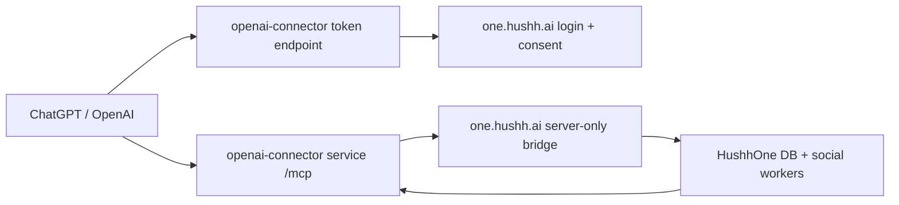

# HushhOne OpenAI Connector Service

Standalone production MCP/OAuth service for the official ChatGPT/OpenAI connector.

This service is intentionally separate from the One Next.js app:

- OpenAI talks to this service for MCP discovery, OAuth token exchange, and tool calls.
- HushhOne (`one.hushh.ai`) remains the login and consent broker.
- Private account/social/scan data is fetched through a server-only One bridge route protected by `ONE_CONNECTOR_TOOL_API_KEY`.

## Endpoints

- `GET /health`
- `GET /.well-known/oauth-protected-resource`
- `GET /.well-known/oauth-authorization-server`
- `GET /.well-known/openid-configuration`
- `GET /.well-known/openai-apps-challenge`
- `POST /api/openai/oauth/register`
- `POST /api/openai/oauth/token`
- `GET /mcp`
- `POST /mcp`

## Required Env

```bash
CONNECTOR_AUTHORIZATION_ORIGIN=https://one.hushh.ai
CONNECTOR_JWT_SECRET=<Secret Manager: CONNECTOR_JWT_SECRET>
ONE_CONNECTOR_TOOL_URL=https://one.hushh.ai/api/openai/connector/tool
ONE_CONNECTOR_TOOL_API_KEY=<Secret Manager: openai-connector-service-api-key>
OPENAI_APPS_CHALLENGE_TOKEN=<OpenAI dashboard challenge token>
```

`CONNECTOR_PUBLIC_ORIGIN`, `CONNECTOR_RESOURCE`, and `CONNECTOR_ISSUER` are optional. Leave them unset on Cloud Run so the service uses its public request host.

## Local Run

```bash
npm install
CONNECTOR_JWT_SECRET=local-dev \
ONE_CONNECTOR_TOOL_API_KEY=local-dev \
npm start
```

## Production Flow



## Tool Surface

- `search`
- `fetch`
- `one_get_account_context`
- `one_connect_linkedin_url`
- `one_connect_instagram_url`
- `one_get_scan_status`
